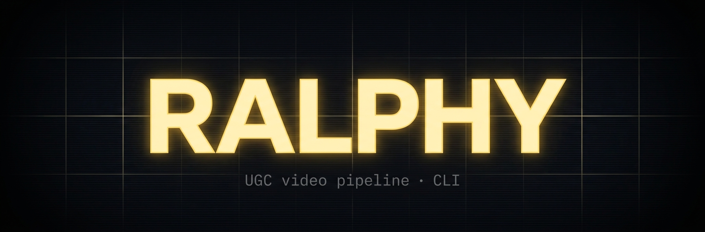

<div align="center">



**An autonomous UGC-video studio in one repo.** Drive it from a chat. Get an mp4 in ~8 minutes.

[](https://github.com/alecs5am/ralphy/actions/workflows/test.yml)
[](https://github.com/alecs5am/ralphy/actions/workflows/release.yml)
[](https://github.com/alecs5am/ralphy/releases)
[](#contributing)

</div>

---

## What is this

`ralphy` is a CLI + Remotion render pipeline + AI-agent skill bundle that turns a one-line brief into a finished UGC-style mp4. It wires up **OpenRouter** (image, video, LLM, vision, transcription), **ElevenLabs** (voice + music), **Remotion** (composition + final render), and a local **bun + SQLite** job queue.

Two API keys. Two commands. Then ask your agent for a video.

## Demo

[**See what Ralphy makes →**](https://ralphy.dev/#showcase) (11 rendered outputs from real projects).

<div align="center">
  <video src="https://raw.githubusercontent.com/alecs5am/ralphy/main/landing/public/assets/showcase/glitter-cream-001.mp4" width="320" autoplay loop muted playsinline>
    <a href="https://ralphy.dev/#showcase">Watch on ralphy.dev →</a>
  </video>
</div>

**Cost:** ~$8–12 per 30s video. **Speed:** ~8 min cold-start, ~25 min for a 10-batch.

## Install

| Platform | Command |
|---|---|
| macOS (Homebrew) | `brew install alecs5am/tap/ralphy` |
| Linux / macOS (curl) | `curl -fsSL https://raw.githubusercontent.com/alecs5am/ralphy/main/install.sh \| sh` |
| Windows (PowerShell) | `irm https://raw.githubusercontent.com/alecs5am/ralphy/main/install.ps1 \| iex` |
| Cross-platform (npm) | `npm install -g @alecs5am/ralphy` |

All four ship the same statically-linked binary. Then:

```bash
ralphy setup          # interactive wizard — paste the two API keys + install agent skill
ralphy doctor         # verify env is green
```

## 5 things to try first

```bash
# 1. Create your first project under ~/.ralphy/projects/
ralphy new "Spring 2026 ad for my espresso machine" --id espresso-001

# 2. Find a template by free-text utterance
ralphy template suggest "talking head rant about deadlines"

# 3. Clone a style from a public URL (TikTok / Reels / Shorts)
ralphy clone https://tiktok.com/@x/video/72939...

# 4. Generate one image (dry-run = $0)
ralphy generate image --project espresso-001 --slot scene-01-bg \
  --prompt "studio packshot, white seamless, 50mm, photoreal not glossy" --dry-run

# 5. Render the project to mp4 (once assets are in place)
ralphy render espresso-001
```

The full surface is in [`docs/cli-surface.md`](docs/cli-surface.md) and on [Mintlify](https://ralphy.dev/docs).

## Documentation & community

| Surface | Read when |
|---|---|
| [**Mintlify docs**](https://ralphy.dev/docs) | Quickstart, concepts, cookbook, CLI reference (auto-gen). |
| [`AGENTS.md`](AGENTS.md) | First. Routing rules + the "read the playbook before acting" discipline. |
| [`MODELS.md`](MODELS.md) | Before **every** model call. Claude's training is stale on model names. |
| [`docs/playbooks/`](docs/playbooks/) | Per-role instructions (researcher, scenarist, art-director, editor, producer). |
| [`docs/templates-index.md`](docs/templates-index.md) | Template roster + categories. |
| [`templates/CATEGORIES.md`](templates/CATEGORIES.md) | Slug-by-category template roster. |
| [GitHub Discussions](https://github.com/alecs5am/ralphy/discussions) | Q&A, Show & Tell, Tester feedback. The single community channel for v1.0. |

## Contributing

```bash
git clone https://github.com/alecs5am/ralphy.git
cd ralphy && bun install

bun test                       # unit + integration
bun run lint                   # eslint + tsc
bun run lint:errors            # error-code catalog drift check
bun run lint:help-examples     # landing claims vs --help parity
bun run docs:cli               # regenerate docs-mintlify/reference/cli/

bun run build:bin              # build cross-platform binaries
```

A pre-commit hook runs the test suite. CI runs the same on push/PR.

PRs welcome — especially new templates (`templates/<category>/<slug>/`), new model entries in `MODELS.md`, and bug fixes in `cli/lib/providers/`. For non-trivial changes, open an issue first or start a discussion.

## License

UNLICENSED for now. Drop a note in [Discussions](https://github.com/alecs5am/ralphy/discussions) if you want a permissive license for your use case — a public license is on the v1.0 launch checklist.

---

<div align="center">

Built with <a href="https://claude.com/claude-code">Claude Code</a>, <a href="https://bun.sh">Bun</a>, <a href="https://remotion.dev">Remotion</a>, <a href="https://openrouter.ai">OpenRouter</a>, and <a href="https://elevenlabs.io">ElevenLabs</a>.

</div>
