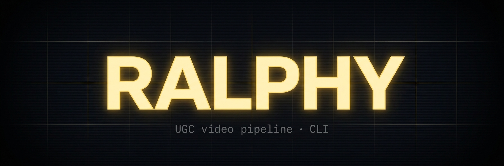
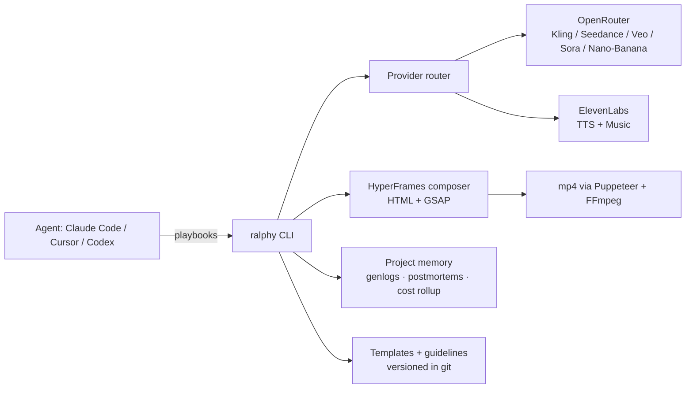

<div align="center">



# Your AI video pipeline as code.

**Open-source, agent-native CLI for AI video.** Fork-able, observable, reproducible.
Drive it from Claude Code / Cursor / Codex. Get an mp4 in ~8 minutes.

[](https://github.com/alecs5am/ralphy/actions/workflows/test.yml)
[](https://github.com/alecs5am/ralphy/actions/workflows/release.yml)
[](https://github.com/alecs5am/ralphy/releases)
[](LICENSE)
[](#contributing)

</div>

---

## What it is

Two API keys (`OPENROUTER_API_KEY` + `ELEVENLABS_API_KEY`), one CLI, a video pipeline you can ship to prod. Ralphy wires up image / video / vision / LLM (OpenRouter), voice + music (ElevenLabs), HTML+GSAP composition (HyperFrames), and a local async-job queue (bun + SQLite). Your agent drives it.

## Demo

[**See what Ralphy makes →**](https://www.alecs5am.com/library) — real rendered outputs from real projects.

**Cost:** ~$8–12 per 30s video. **Speed:** ~8 min cold-start, ~25 min for a 10-batch. **Engine:** HyperFrames (HTML + GSAP, deterministic Puppeteer + FFmpeg render).

## Install

| Platform | Command |
|---|---|
| macOS (Homebrew) | `brew install alecs5am/tap/ralphy` |
| Linux / macOS (curl) | `curl -fsSL https://raw.githubusercontent.com/alecs5am/ralphy/main/install.sh \| sh` |
| Windows (PowerShell) | `irm https://raw.githubusercontent.com/alecs5am/ralphy/main/install.ps1 \| iex` |
| Cross-platform (npm) | `npm install -g @alecs5am/ralphy` |

All four ship the same binary.

```bash
ralphy setup          # interactive wizard — paste the two API keys + install agent skill
ralphy doctor         # verify env is green
```

Expected output:

```
✦ ralphy v0.3.0
▸ Dependencies          ✓ bun  ✓ ffmpeg
▸ API keys              ✓ OPENROUTER_API_KEY  ✓ ELEVENLABS_API_KEY
  ✓ ready
```

> **macOS Gatekeeper warning?** You used the direct-download path. Brew / npm / `install.sh` bypass Gatekeeper automatically. If you hit it: `xattr -d com.apple.quarantine /path/to/ralphy` once and you're done.
>
> **Verify your install:** every Release includes a `SHA256SUMS` file. `shasum -a 256 -c SHA256SUMS` (macOS / Linux) or `Get-FileHash` (Windows) confirms the binary matches.

## 60-second tour

```bash
# 1. Create a project
ralphy new "Spring espresso ad" --id espresso-001

# 2. Find a template by free-text utterance
ralphy template suggest "talking head rant about deadlines" -p
```
```
✦ Query: "talking head rant about deadlines"
  1. ✓ talking-head-rant  ███████████░░░░░  0.70  strong
  2. ⚠ storytime          ████████░░░░░░░░  0.50  weak
  3. ⚠ yap-talking-head   ████████░░░░░░░░  0.50  weak
```
```bash
# 3. Scaffold from the chosen template (assets auto-pull from companion repo)
ralphy template use talking-head-rant --id espresso-001

# 4. Cost-preview before spending a cent
ralphy generate image --project espresso-001 --slot scene-01-bg \
  --prompt "studio packshot, white seamless, 50mm, photoreal" --dry-run

# 5. Render the project to mp4
ralphy render espresso-001
```

That's it. Full CLI surface in [`docs/cli-surface.md`](docs/cli-surface.md).

## Why Ralphy

What you actually get vs other ways to do this:

|  | Closed SaaS (Higgsfield, HeyGen, Captions) | Other OSS (ShortGPT, MoneyPrinterTurbo) | **Ralphy** |
|---|---|---|---|
| Source | Closed | OSS (script-shaped) | **Apache 2.0, fork-able** |
| Agent surface | Their cloud agent | None | **Local skills + playbooks; works in any agent** |
| Models | Vendor lock-in | One model, hardcoded | **Any OpenRouter model — Kling / Seedance / Veo / Sora / Nano-Banana** |
| Cost transparency | Subscription black box | Free-but-you-DIY | **`--dry-run` shows the bill before you spend** |
| Reproducibility | Vibes | Vibes | **Append-only genlogs + postmortems + templates-as-git** |
| Quality gates | Best-effort | None | **Refuse-not-warn: bad scene = no render** |
| Reference grounding | None | None | **Built-in research engine (`ralphy research`) + guideline library** |
| Composer | Web canvas (theirs) | MoviePy / FFmpeg scripts | **HyperFrames (HTML + GSAP) — versioned in git, tested in CI** |

The hard rule that makes the rest work: **`ralphy <verb>` is the only entry-point.** No ad-hoc `ffmpeg` shell-outs, no direct provider fetches, no orphan scripts. Every model call lands in `generations.jsonl`, every cost in the rollup, every failure in the postmortem.

## Architecture


```mermaid
graph LR
    A[Agent: Claude Code / Cursor / Codex] -->|playbooks| B[ralphy CLI]
    B --> C[Provider router]
    C --> D[OpenRouter<br/>Kling / Seedance / Veo / Sora / Nano-Banana]
    C --> E[ElevenLabs<br/>TTS + Music]
    B --> F[HyperFrames composer<br/>HTML + GSAP]
    F --> G[mp4 via Puppeteer + FFmpeg]
    B --> H[Project memory<br/>genlogs · postmortems · cost rollup]
    B --> I[Templates + guidelines<br/>versioned in git]
```

5 agent roles (researcher / scenarist / art-director / editor / producer) routed via [`AGENTS.md`](AGENTS.md). The router decides which playbook the agent reads before acting.

## Documentation & community

| Surface | Read when |
|---|---|
| [**Library**](https://www.alecs5am.com/library) | Browse published units + templates with live rendered previews. |
| [`AGENTS.md`](AGENTS.md) | First. Routing rules + the "read the playbook before acting" discipline. |
| [`MODELS.md`](MODELS.md) | Before **every** model call. Claude's training is stale on model names. |
| [`docs/playbooks/`](docs/playbooks/) | Per-role instructions (researcher, scenarist, art-director, editor, producer). |
| [`templates/CATEGORIES.md`](templates/CATEGORIES.md) | 64 templates (7 vibe-reference + 57 vibe-style), by category. |
| [GitHub Discussions](https://github.com/alecs5am/ralphy/discussions) | Q&A, Show & Tell, Tester feedback. |

## Contributing

```bash
git clone https://github.com/alecs5am/ralphy.git
cd ralphy && bun install

bun test                       # unit + integration (1,000+ tests)
bun run lint                   # typecheck + project lints (errors / help-examples / skills / agents-md / templates / cli-surface)
bun run docs:cli               # regenerate docs-mintlify/reference/cli/
bun run build:bin              # build cross-platform binaries
```

A pre-commit hook runs the test suite. CI runs the same on push/PR.

PRs welcome — especially:
- **New templates** under [`templates/<category>/<slug>/`](templates/) (5 categories: b2b-saas, dtc-commerce, creator-lifestyle, entertainment-viral, cinematic-narrative).
- **New model entries** in [`MODELS.md`](MODELS.md) with real cost numbers + known pitfalls.
- **Bug fixes** in [`cli/lib/providers/`](cli/lib/providers/).
- **New guidelines** under [`guidelines/<slug>/`](guidelines/) (image-prompt rules — tag-able from chat as `@guideline:<slug>`).

For non-trivial changes, open an issue first or start a discussion.

## License

[Apache 2.0](LICENSE). Use, fork, ship to prod — patent grant included.

---

<div align="center">

Built with <a href="https://claude.com/claude-code">Claude Code</a>, <a href="https://bun.sh">Bun</a>, <a href="https://github.com/heygen-com/hyperframes">HyperFrames</a>, <a href="https://openrouter.ai">OpenRouter</a>, and <a href="https://elevenlabs.io">ElevenLabs</a>.

</div>
