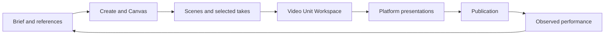

# Creator platform research and product opportunities

Date: 2026-09-07
Product: Ralphy Desktop
Status: Research and proposals; not an implementation commitment

Companion document: [Video Unit Workspace — design brief](2026-09-07-video-unit-workspace-design-brief.md).

## 1. Main recommendation

Develop Ralphy into a continuous creative production workspace: a brief produces references and alternatives; selected material becomes an editable composition; a Unit carries its versions, platform presentations, publications, and performance into the next iteration.

The highest-value next step is an editable workspace inside video Units. The existing desktop already has the beginnings of the required content model. Connecting those pieces into a daily workflow should take priority over expanding the model catalog alone.

**Confirmed direction for the video workspace: build Ralphy's own UI and use HyperFrames as the composition/rendering engine.** This supersedes the earlier suggestion to embed the ready-made HyperFrames Studio UI. Studio remains a capability and interaction reference, not the interface to ship.

## 2. Research method and confidence

- Reviewed public product pages, help centers, and technical documentation for Higgsfield, FLORA, Figma Weave/Weavy, LTX Studio, Runway, Descript, OpusClip, and HyperFrames.
- Read relevant Ralphy Desktop contracts and Unit/composition presentation code.
- Competitor features below are documented or advertised capabilities. Paid product workspaces were not tested in this research.
- Recommendations are product judgments, not claims that every competitor lacks the suggested feature.
- Current live documentation can differ from search-index excerpts. Directly fetched HyperFrames documentation includes timeline splitting and keyframe editing that older indexed excerpts describe more narrowly. The live Weavy site identifies the product as Figma Weave.
- No engine integration prototype was built. Available Studio functionality is evidence of engine-adjacent capability, not proof of a stable public API for a custom editor.

## 3. What is already present in Ralphy

The desktop contains Create, working canvases, Units, a shared library, Context, Memory, project workspaces, a calendar, and performance views. Canvas interaction supports exploration and workflow execution, connected media, model selection, and result history.

The important existing production relationships are:

| Existing concept | What it already makes possible | Opportunity |
| --- | --- | --- |
| Unit and Unit revisions | A persistent deliverable with latest/selected revisions | Make the Unit the entry point for editing and reviewing |
| Composition and composition revisions | Source material, inputs, engine identity, draft/sealed revisions | Open an editable composition behind the deliverable |
| Builds and build outputs | Render state and output artifacts attached to a revision | Separate the editable draft from a rendered result |
| Unit presentations | Platform-specific caption, cover, and crop relationships | Produce several platform presentations from one creative work |
| Publications and overview metrics | Delivery state and observed performance | Connect results to the exact creative version |
| Shared library, Context, Memory | Reusable material and working knowledge | Make references and accepted creative decisions directly usable |

These are foundations, not proof that the complete proposed workflow is implemented. The inspected desktop does not yet provide the custom timeline editor described in the companion brief.

Relevant repository references:

- [Unit, composition, build, and presentation contracts](../../electron/ralphy/types.ts)
- [Current Unit viewer](../../src/pages/project/ui/UnitViewer.tsx)
- [Unit lifecycle](../../src/entities/unit/lib/unit-lifecycle.ts)
- [Composition controller](../../src/pages/project/model/composition-section.ts)
- [Canvas workspace](../../src/features/workflow-canvas/ui/CanvasScreen.tsx)
- [Unit performance presentation](../../src/pages/workspace/ui/WorkspaceUnitOutcomes.tsx)

## 4. Findings from comparable products

### Higgsfield: creative direction and continuity

Canvas places prompts, references, models, and outputs on a shared graph. Its public documentation describes reusable templates, collaboration, and bringing existing assets or characters into the graph. Cinema Studio exposes creative controls such as camera movement, lighting, and reusable cast/locations.

**Application to Ralphy:** provide meaningful creative controls and persistent references above provider-specific parameters. Let the chosen visual direction travel from an image into a shot and then into a Unit. The useful lesson is continuity of decisions across tools.

Sources: [Canvas](https://higgsfield.ai/canvas-intro), [Cinema Studio](https://higgsfield.ai/cinematic-video-generator), [tool selection guide](https://higgsfield.ai/creator-hub/help-center/tools/which-higgsfield-tool-should-i-use).

### FLORA: save the creative process

FLORA presents reusable Techniques and client-specific creative systems. Its agency workflow connects ideation, visual directions, brand rules, storyboards, and repeatable output production.

**Application to Ralphy:** save a successful workflow together with its inputs, reference set, and useful defaults. A workflow should be reusable on the next brief without rediscovering how the previous project was made.

Sources: [FLORA](https://flora.ai/), [agency workflows](https://flora.ai/solution-agency).

### Figma Weave / Weavy: turn a graph into a tool

The current Weavy site identifies the product as Figma Weave. Alongside models, it presents conventional editing operations such as masks, crop, compositing, and relighting. It also describes generating a simplified interface from a workflow.

**Application to Ralphy:** let a creator expose a few workflow inputs as a form. The author works on the graph; repeated daily use can happen through Create or an agent action. Keep conventional media operations available alongside generation.

Source: [Figma Weave / Weavy product page](https://www.weavy.ai/).

### LTX Studio: scenes between generation and final video

LTX describes an integrated environment containing generation, storyboards, a video editor, and reusable elements for characters, props, and branding.

**Application to Ralphy:** introduce scenes and takes within a video Unit. Scenes describe the story; takes are alternative realizations; a timeline determines the final timing. A node graph alone does not communicate that editorial structure well.

Source: [LTX platform overview](https://support.ltx.studio/hc/en-us/articles/32487503247122).

### Runway: retain and refine useful results

Runway's workflow guide describes switching to previous outputs, favoriting results, and converting a result into a standalone input. Edit Studio applies targeted changes to existing footage with prompts and references.

**Application to Ralphy:** preserve provenance and make iteration local. A user should be able to replace a take or improve a scene while retaining the surrounding edit. Compare alternatives before replacing the active result.

Sources: [workflow guide](https://help.runwayml.com/hc/en-us/articles/45769159004691-Building-your-first-Workflows), [Edit Studio](https://help.runwayml.com/hc/en-us/articles/51683104370451-Creating-with-Edit-Studio).

### Descript: manual and agent editing share the same work

Descript combines text-based editing, scenes/layouts, and an editing agent. It supports requests grounded in an existing recording or edit rather than requiring every operation to be discovered manually.

**Application to Ralphy:** make selection a shared language between the user and agent. A selected clip, title, or time range should become the scope of a request. Agent changes must remain visible, inspectable, and reversible in the same editor.

Sources: [Underlord](https://www.descript.com/underlord), [Descript workflow](https://www.descript.com/).

### OpusClip: continue through delivery

OpusClip connects clipping and editing with captions, platform adaptation, scheduling, and publication analytics. Its calendar page describes viewing engagement and viewership alongside scheduled and published content. Some other marketing pages still mark analytics as forthcoming; availability should be checked in the actual product before a procurement decision.

**Application to Ralphy:** keep a clear path from an editable Unit to its platform presentations and publication results. Adaptation and delivery should reuse the same material and version history.

Source: [OpusClip calendar](https://www.opus.pro/calendar).

## 5. Proposed product model

The graph illustrates a proposed user journey, not a new storage schema. Reuse existing projects, Units, compositions, and revisions before introducing additional entities.

## 6. Opportunities and concrete proposals

### A. A workspace inside video Units — first priority

Open an editable video from its Unit into the full application work area. Provide a large stage, a timeline, a collapsible library, an inspector, and agent actions scoped to the selection.

Required product outcome: a user can change a title manually, ask the agent to replace a scene, save a new version, and render that version without moving the work into another application.

Use the existing Unit identity throughout. Keep an editable composition linked to the Unit; preserve rendered versions and the original source material.

### B. Scenes and takes

Give a video an understandable sequence such as Hook → Demonstration → Proof → CTA. Each scene has a purpose, duration, references, and candidate takes.

Allow synchronized comparison, choosing a take, retrying one scene, and returning to its generating node. Replacing footage should preserve compatible trim, audio, and overlay decisions, with an explicit choice when durations differ.

Integrate this into the Unit workspace rather than adding another unrelated destination. Stage a basic take chooser first; broader storyboarding can follow.

### C. Persistent characters, products, and brand systems

Evolve Shared Library into reusable creative records with named references, selected appearances, voices, and applicable rules. Expose them in Create, Canvas, and the video workspace.

Examples:

- Character: approved reference images, voice, description, and continuity constraints.
- Product: reference photography, packaging, logo, and verified product facts.
- Brand: typography, colors, title/caption treatments, examples, and motion preferences.

Clarify Context and Memory through use: Context holds source information and current constraints; Memory holds accepted decisions and preferences worth applying again. Show which records and rules were used for a result. References guide generation; they do not guarantee model consistency.

### D. Canvas → reusable tool

Allow a workflow author to choose exposed inputs and save a tool available in Create. For example: Product, Audience, Language, Duration, and Number of variants.

Each tool needs an example result, required inputs, provider requirements, an estimated cost when available, output types, and an action to reopen its graph. This gives the marketplace a useful artifact beyond a prompt or a list of models.

### E. Content packages and controlled variants

Treat a project brief as a request for a related set of deliverables: a video, alternate openings, a cover, a carousel, and platform presentations.

Offer a compact variant matrix such as three hooks × two CTAs × two formats. Let the user select combinations and see the workload and estimated cost before executing. Preserve successful material and rerun changed dependencies where supported; distinguish reuse from actual regeneration.

Keep creative alternatives distinct from platform formatting. A new crop is not automatically a new creative concept. Reuse projects and Unit presentations where they already express this relationship.

### F. Performance → next creative iteration

Link observations to the actual published revision and platform presentation. Show which opening, length, cover, or CTA was used, then let the user open that work and create another version.

The future workflow could suggest changing an underperforming first scene and compare it with stronger work. Recommendations must distinguish observations from hypotheses and show insufficient data. Do not substitute an invented virality score for measured results or imply causality from a small comparison.

This extends the current overview rather than requiring a separate analytics application.

### G. Confidence in editing and review

Make it easy to answer: What changed? Which version is selected? Which exact version was rendered or published? Can I return to my manual edit?

Start with version comparison, selection-aware agent edits, recoverable history, and render snapshots. Later, add timestamped review comments and lightweight approval on a specific version. Full simultaneous multiplayer editing is a separate investment, not a prerequisite for the first workspace.

## 7. HyperFrames assessment under the custom-UI decision

HyperFrames describes an open-source HTML/CSS/media composition framework that produces deterministic video renders. Its current documentation demonstrates timeline manipulation, nested scenes, undo, keyframes, and render tooling. Sources: [repository](https://github.com/heygen-com/hyperframes), [timeline](https://hyperframes.heygen.com/guides/timeline-editing), [animation](https://hyperframes.heygen.com/studio/animation), [CLI](https://hyperframes.heygen.com/packages/cli).

The proposed ownership boundary is:

| Ralphy owns | HyperFrames supplies, subject to integration verification |
| --- | --- |
| The full editor interface and interaction model | Composition execution and rendering |
| Units, version selection, source ownership, and history UX | The supported authoring/animation representation |
| Timeline and inspector controls | Preview/seek behavior that must match the renderer |
| Library, takes, provider selection, and agent context | Existing composition tooling where a usable contract exists |
| Render queue UX and links to output artifacts | Render execution and produced files |

Do not infer that the Studio UI is a drop-in headless editing SDK. Identify and verify the callable contracts for parsing, playback, mutations, and rendering against a pinned version before committing to an implementation approach.

There are two entry cases:

1. **Editable composition available:** open a draft derived from its source and preserve the layer structure.
2. **Only a rendered video available:** create an editable composition containing that video as a clip. Original titles, cuts, or generated objects inside the pixels do not become independent layers.

Some computed or helper-generated animations cannot be safely rewritten through direct manipulation. HyperFrames documents both supported conversion to editable animation and cases requiring source editing. Our UI should expose the supported controls and route the remainder to a contextual agent request, preserving the original source.

Technical validation should prove a complete round trip: load source → edit through Ralphy → save a revision → reload → render → compare with preview. Also verify asset resolution, undo, concurrent agent edits, render cancellation, and recovery. HyperFrames engine work should remain behind the existing Ralphy CLI/runtime contract; do not import code from a sibling repository.

## 8. Suggested sequence

| Stage | Deliverable | Evidence of success |
| --- | --- | --- |
| 1 | Custom video Unit workspace and HyperFrames round trip | One real Unit can be edited manually and by an agent, versioned, reopened, and rendered |
| 2 | Scene/take selection and reusable creative records | Replace one shot and retain the edit; reuse the same product/character in another Unit |
| 3 | Workflow tools and controlled content packages | Run a saved process from a small form and produce selected variants with clear costs |
| 4 | Publication-version linkage and performance-driven iteration | Open the precise published work from a metric and create a traceable next version |

Suggested initial success measures: time from generated material to a usable video, time to make a small correction, successful source reloads, preview/render agreement, and completion without exporting to another editor. Use actual observations from UX Testing Lab before setting numerical targets.

## 9. First end-to-end exercise

Use an existing video Unit in UX Testing Lab with source media and an editable composition where available.

1. Open the Unit and enter its workspace.
2. Change a title manually and move its appearance time.
3. Select a scene and ask the agent to replace its take while preserving the title.
4. Review and apply the changes without overwriting intervening manual work.
5. Save a version, close the editor, and reopen it.
6. Render that version and compare it with the preview.
7. Create one platform presentation while keeping the original version accessible.

This exercise should define the first design prototype and engine integration proof. It does not require building every later opportunity first.
