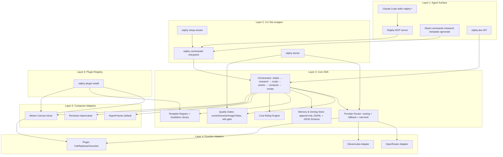

# Прожарка Ralphy: полный аудит, стратегический разбор, таргет-архитектура и роадмап

> Аудит репозитория `alecs5am/ralphy` по состоянию на 25 мая 2026 (v0.2.0, 282 коммита, 6 звёзд, 1 форк, license `UNLICENSED`). Документ написан для владельца, без хеджей и вежливости. Если что-то названо мусором — это мусор, и ниже сказано, что с этим делать.

---

## TL;DR — три вещи, которые надо услышать первыми

- **У тебя в репо лежит ОЧЕНЬ хороший «второй слой» (playbook discipline, MODELS.md как живой knowledge base, append-only генлоги, intake-гейты, `--dry-run`, асинхронная очередь jobs.sqlite, install.sh уровня production) — это редкий, серьёзный, production-grade инжиниринг.** Но «первый слой» (позиционирование, README, install-narrative, демо, дистрибуция, лицензия) на уровне хорошего pet-проекта. Ты строишь Boeing и продаёшь его как самокат — отсюда 6 звёзд против 52.5k у MoneyPrinterTurbo. Это **не дефект продукта** — это дефект упаковки и моушна.
- **Главный конкурент — НЕ Higgsfield Supercomputer.** Higgsfield играет в SaaS-агента с собственными моделями и influencer-distribution на $300M ARR-роуте, его в лоб не догнать. Реальная конкуренция Ralphy — слой OSS agent-native CLI (aider 45.2k, Cline 58-62k, claude-code-router 26.4k, Continue 32-33k, OpenInterpreter ~58k) и framework-уровень (Remotion 47.3k, HyperFrames от HeyGen, MoneyPrinterTurbo 52.5k). Higgsfield — это твоё **«anti-pattern poster»**: они закрытый SaaS-агент идут в Marketing Studio + Hermes Agent + MCP; именно от их закрытости ты должен оттолкнуться позиционированием. Открытый, форкабельный, agent-native CLI = единственная защитимая ниша.
- **Дорожная карта на 10k+ звёзд за 12 месяцев существует, но требует жестокого сокращения**: сменить лицензию на Apache 2.0 сегодня, переписать README по схеме aider/OpenInterpreter (60-секундный MP4 + однострочный install + benchmark/leaderboard), удалить Remotion и `dashboard/`, ship `ralphy mcp serve` к v0.3.0, переименовать `package.json.name`, вытащить MODELS.md как публичную SEO-страницу, запустить публичный «Ralphy Quality Score» leaderboard (как aider сделал на SWE-Bench Lite), и закрыть дистрибуционный гэп еженедельным Friday Ship.

---

## Key Findings

1. **Архитектурно Ralphy уже опережает OSS-конкурентов.** Single-key setup, hard invariant «`ralphy` — единственная точка входа», JSON-default CLI, async-job queue с topo-sort и symbolic deps, append-only генлоги с regen→.v2 правилом, refuse-not-warn quality gates, intake playbook, MODELS.md с per-model param matrix и lessons-секцией — этого набора нет ни у ShortGPT, ни у MoneyPrinterTurbo, ни у Hyperframes без обвязки. Это твой реальный moat.
2. **Дистрибуционно Ralphy сейчас — нулевой.** 6 звёзд после 282 коммитов и публичной landing-страницы (ralphy.dev) — это сигнал, что инженерная работа делается, а медиа-работа не делается вообще. Higgsfield для сравнения шипит, по их собственному CEO Алексу Машрабову, «*We release product updates almost every day. This rhythm keeps us learning faster than anyone else in the space, and that's unlikely to change.*» Без сопоставимой *cadence публичных артефактов*, не CLI-апдейтов, ты не наберёшь и 1k звёзд.
3. **Лицензия `UNLICENSED` — однострочный stop-flag для любой корпоративной адопции.** Это самая дешёвая правка в этом отчёте и самая высоко-leverage. Apache 2.0 PR — 5 минут, +x% к скорости роста звёзд бесплатно.
4. **Имя пакета `package.json.name: "ugc-cli"` + description «My Remotion video» + бинарь `ralphy` + npm `@alecs5am/ralphy` — фрагментация identity.** Forker открывает package.json и видит четыре разных названия одного и того же продукта. Это маленькая, но *первая* трещина в доверии.
5. **Remotion как «legacy» — продолжает быть прописан в зависимостях (4.0.441), в `remotion.config.ts` в корне репо, в `"dev": "remotion studio"` в scripts.** Хуже того, Remotion имеет коммерческую лицензию: согласно их LICENSE.md и remotion.dev/docs/license, *«Remotion is free to use for individuals and companies up to three people»* — Company License требуется с **четырёх сотрудников и выше**. То есть юридически Ralphy сейчас не open-source для любого forker'а с командой 4+. Удалять Remotion из default'а — yesterday.
6. **HyperFrames — это правильный выбор composer'а, но Ralphy сейчас — thin wrapper над `hyperframes^0.6.31` npm-пакетом.** HyperFrames — open-source от HeyGen под Apache 2.0, прямой конкурент Remotion с лучшей лицензией и AI-first DX. Их позиционирование: *«Remotion's bet is React components; Hyperframes' bet is HTML.»* Это плюс — но если HeyGen завтра форсирует свой `hyperframes` CLI и swallowed orchestration наверх, у тебя нет защиты без явного Composer Adapter слоя (см. §4).
7. **MODELS.md (21.2 KB) — лучший контент в репо и одновременно скрытый файл.** Постмортем-знания (kling rotation bias на 9:16, seedance privacy filter на photoreal humans с ошибкой `InputImageSensitiveContentDetected.PrivacyInformation`, gpt-5.4-image-2 concurrent cap of 1, elevenlabs music_v1 cap of 2, gemini IMAGE_SAFETY на body-horror) — это unique SEO/content moat, который сейчас спрятан. Вытащить его как ralphy.dev/models — бесплатный evergreen content.
8. **Сегмент «casual users» правильно отброшен.** Это не приоритет. Higgsfield Marketing Studio (paste URL → 9 UGC formats), HeyGen, Captions, Submagic, OpusClip — они заберут эту аудиторию через UX и influencer-distribution. У Ralphy там нет шансов, и хорошо что владелец это уже понимает.
9. **`dashboard/` папка + invariant «no auto-launched processes, chat is the interface» — внутреннее противоречие**, которое сигналит, что владелец сам не определился. Решить нужно вчера: CLI-only или CLI+UI. Если CLI-only — удалить папку.
10. **MCP-server отсутствует.** В 2026 это must-have. Higgsfield выкатил `mcp.higgsfield.ai/mcp` 28 апреля 2026, который exposes 30+ моделей (Sora 2, Veo 3.1, Kling 3.0, Seedance 2.0, Nano Banana Pro, Soul 2.0, Flux 2) как agent tools в Claude/Cursor/OpenClaw. Если Ralphy позиционируется как «Claude Code + Ralphy», `ralphy mcp serve` обязан быть в v0.3.0.

---

## Details

### 1. Послойный разбор подсистем

| Слой | Что есть | Сильные стороны | Слабые стороны / антипаттерны |
|---|---|---|---|
| **CLI (`cli/index.ts`, Commander)** | Resource-based CRUD: brand/persona/ref/project/template/batch/asset/workspace/profile + generate/render/queue/daemon/doctor/setup. JSON-default, `-p` pretty. `--dry-run` на video. | Контракт «JSON по умолчанию + `-p` для человека» — это серьёзно. `--dry-run` с cost estimate. Lint suite (`lint:errors`, `lint:help-examples`, `lint:skills`, `lint:agents-md`). | `package.json.name === "ugc-cli"` при бинаре `ralphy` и npm `@alecs5am/ralphy`. Description `"My Remotion video"` — артефакт. `license: UNLICENSED` для OSS-проекта — смерть звёзд. |
| **Agent / Playbook (`AGENTS.md`, `docs/playbooks/`, `.agents/skills/`)** | Routing-таблица user→playbook, дисциплина «прочитал playbook → действуй», dev-mode/user-mode, hard invariants (no FAL_KEY, ralphy = only entry-point, ref-required gate, quality gates refuse-not-warn). | **Самая сильная часть проекта.** Никто в OSS этого уровня playbook-дисциплины не делает. Идея «AGENTS.md = роутинг-контракт для Claude Code» — это прямой плагин в Claude Code skills ecosystem и в новый MCP-мир. | 16.6 KB одного файла системного промпта — дорого по токенам на каждом вызове. Нужна сегментация: тонкий router (`AGENTS.md`, 2-3 KB) + lazy-loaded playbook-блоки. Сейчас агент ест AGENTS.md+CLAUDE.md+MODELS.md (21 KB) на каждый turn. |
| **Intake / Quality Gates (`docs/playbooks/intake.md`, `scoreScenario`, `scoreImage`, `scoreVideo`)** | Brand/audience/aesthetic clarification, refuse-on-double-fail логика, refs-required-gate для real entities. | Концептуально уникально в OSS. Близкий аналог только у Higgsfield (Approval Gates), но они закрытые. | Не очевидно из README, что эти гейты есть. Это твоя главная фича — а ты её прячешь. |
| **Research (`ralphy research`, `ralphy ref`, `.agents/skills/ralphy-researcher`)** | Deep-research, scrape-trends, blueprint, guideline library, `template suggest`. | Тоже уникально: ни ShortGPT, ни MPT, ни Hyperframes этого не делают. | Названия размазаны: `ref`, `research`, `guideline`, `template suggest`, `clone <url>`. Для нового пользователя — пять команд про «найди вдохновение», и непонятно когда какую. Нужен зонтик: `ralphy research` с поддоменами. |
| **Generation routing (OpenRouter + ElevenLabs через `cli/lib/providers/media.ts`, `llm.ts → callLLM()`)** | Чистая абстракция: одна точка входа на media, одна на LLM. Hard invariant запрещает прямые fetch к fal.ai/openai.com. Async-job pattern для OpenRouter video (15s × 80 = 20 min poll). Per-model whitelists. Auto-strip C2PA/EXIF на фреймах (фикс 2026-05-19). | Production-уровень. MODELS.md ведётся как живой knowledge-base. Зафиксированные lesson'ы — kling rotation bias на 9:16, seedance privacy filter (`InputImageSensitiveContentDetected.PrivacyInformation`), gpt-5.4-image-2 concurrent cap = 1 (returns misleading 403 «Key limit exceeded»), elevenlabs music_v1 cap = 2 (429 `concurrent_limit_exceeded`), gemini IMAGE_SAFETY на body-horror. | Нет публичного TS-interface `Provider { capabilities, generate, estimateCost, healthCheck }`. Это главный архитектурный долг для future «custom connectors» — без формального Provider interface ты не сможешь принять PR с «добавить Fal/Replicate/Suno». |
| **HyperFrames composer (default, `hyperframes^0.6.31`)** | HTML+GSAP+data-attrs, seek-driven render через headless Chromium, deterministic. CLI auto-detects engine (HTML → HyperFrames, composition-props.json → Remotion). | Стратегически правильный выбор: HyperFrames это open-source от HeyGen под Apache 2.0, прямой конкурент Remotion с лучшей лицензией и AI-first DX. Skills `/hyperframes`, `/hyperframes-cli` уже встроены в Claude Code. | Ralphy сейчас — thin wrapper над npm-пакетом + кучка skills. Если HeyGen форсирует свой `hyperframes` CLI наверх в orchestration — у тебя нет защиты без явного Composer Adapter слоя. |
| **Remotion (legacy, 4.0.441)** | Поддерживается для совместимости. | — | Чистый tech-debt. Remotion имеет коммерческую лицензию — *«Remotion is free to use for individuals and companies up to three people»* (LICENSE.md, remotion.dev/docs/license). Company License требуется с 4+ сотрудников. Юридически Ralphy сейчас не OSS для любого forker'а с командой 4+. Удалять. |
| **Genlogs / Memory (append-only `generations.jsonl`, `user-prompts.jsonl`, `user-assets.jsonl`, `postmortem/`)** | Hard invariant №14: «append-only on generations, NEVER delete». Regen → `.<slot>.v2.<ext>`. Project-scoped memory. | Архитектура уровня DVC/W&B. Базис для воспроизводимости агентских сессий. | Формат не специфицирован публично (нет `docs/genlog-schema.md` или JSON Schema). Сообщество не может построить tooling поверх. |
| **Templates (`templates/` repo + `workspace/templates/` user-local)** | 5 категорий, 2 kind'а (`vibe-reference` × 5, `vibe-style` × 38), `template suggest <utterance>` ранжирует, `template use` скаффолдит и auto-pulls assets из `ralphy-assets`. | Двух-уровневый namespace с workspace-override — правильно. | Templates — это markdown + JSON, не код. У сообщества нет SDK для написания тестируемого template'а. Сравни с Remotion'овскими TS-template'ами или Hyperframes skill-форматом. |
| **Doctor (`ralphy doctor`)** | Env health (keys, deps, project link), JSON / pretty. | Один из главных «wow» моментов первых 5 минут. | Не рекламируется в README первой строкой. Не показано что именно doctor проверяет. |
| **Batch / Daemon / Queue (`workspace/.ralph/jobs.sqlite`, WAL, topo-sort, symbolic deps)** | SQLite + WAL + auto-detached daemon + ANSI dashboard через `queue watch`. Cascade-block. | Production-grade. Главное преимущество над MPT (там — скрипт + Streamlit). | Daemon не рекламируется. README не показывает «вот как ты ставишь батч из 100 видео ночью» — а это buy-it-now для content-farm сегмента. |
| **Install (`install.sh`, 172 строки)** | Detect OS/arch, latest-release resolve через GitHub API, xattr-strip Gatekeeper на macOS, rc-file PATH update (zsh/bash/fish), SHA256SUMS documented. | Один из самых аккуратных install.sh, что я видел в OSS. Лучше aider'овского `pip install aider-install`. | Бинарь — это `bun build` artifact, завязан на bun-runtime. README пишет «statically-linked binary», что технически неверно. Не критично, но коммуницировать честнее. |
| **Tests (`tests/unit/`, `tests/integration/`, `tests/live/`)** | Husky pre-commit, CI на push/PR, error-code catalog drift check, help-examples vs landing parity. | Уровень дисциплины, которого нет у MPT/ShortGPT. | Coverage не публикуется. Test/CI badge мог бы быть в README. |
| **Docs (`docs/`, `docs-mintlify/`, ralphy.dev на Mintlify)** | Mintlify, auto-generated CLI reference из help (`docs:cli` script). | Mintlify — правильный выбор. Auto-gen CLI ref — отличная дисциплина. | docs-mintlify папка отдельно от docs — потенциально две правды. ralphy.dev разделён между `/showcase`, `/docs`, `/library` — пользователю непонятна навигация. |
| **`dashboard/` папка** | Legacy React/Vite, помечен `_dashboard:legacy`. | — | Удалить. Противоречит invariant'у №5. |
| **`landing/`, `BRAND_DESIGN.md` в корне** | Брендинг развит. | — | `BRAND_DESIGN.md` в корне рядом с `MODELS.md` — шум для contributor'а. |

### 2. Сборная корзина антипаттернов

1. `package.json.name === "ugc-cli"` при бинаре `ralphy` и npm `@alecs5am/ralphy`. **Замени на `ralphy` или `@ralphy/cli`.**
2. `license: UNLICENSED`. **Apache 2.0 PR — 5 минут, наибольший ROI.**
3. Remotion в default deps + `remotion.config.ts` в корне + `"dev": "remotion studio"`. **Удалить.**
4. `bun` как hard-requirement в scripts — барьер для Python/энтерпрайз-аудитории. **Ship reality (binary), убрать `bun` из user-facing docs.**
5. AGENTS.md+CLAUDE.md+MODELS.md = ~45 KB системного промпта на каждом ходе. **Segmentation: thin router + lazy-loaded playbook'и.**
6. Daemon/queue/batch — ниндзя-фича в `--help`, нет в README. **README-блок «batch 100 videos overnight».**
7. `ralphy-assets` companion repo упоминается, но без живого primary-link в README.
8. «5 things to try first» без gif/asciinema/expected output.
9. MODELS.md — лучший контент, спрятан в `.md` файле. **Вытащить как ralphy.dev/models с SEO под `kling pricing`, `seedance privacy filter`, `veo 3.1 4k`.**
10. ralphy.dev/#showcase обещает 11 rendered outputs — нет ни одного embedded autoplay-MP4 в hero.
11. Skills дублируются между `.agents/skills/` и `.claude/skills/`. **Один источник + scripted sync.**
12. **Нет MCP server.**
13. «UNLICENSED for now. Drop a note in Discussions if you want a permissive license» — никто не напишет. Они закроют вкладку.

### 3. Конкурентная карта (25.05.2026)

| Игрок | Слой | Звёзды | Лицензия | Custom models | Agent layer | Composer | Что забирает у Ralphy |
|---|---|---|---|---|---|---|---|
| **Higgsfield Supercomputer** | Closed SaaS | n/a | Закрытый | Свои (DoP, Soul 2.0, Steal) + 30+ orchestrated (Sora 2, Veo 3.1, Kling, Seedance, Nano Banana) | Hermes Agent + Skills Marketplace + Memory + Approval Gates + MCP | Web canvas + Cinema Studio 3.5 (1,296 виртуальных линз) | Всё кроме открытости. $300M ARR run rate в 11 мес. |
| **Higgsfield Marketing Studio + Hermes Agent** (launched ~April 23, 2026) | Closed SaaS | n/a | Закрытый | См. выше | Hermes | См. выше | Прямой конкурент твоему UGC-pipeline. MCP с 28 апреля 2026. |
| **HyperFrames (HeyGen)** | OSS framework | (новый) | Apache 2.0 | — | — | **Это твой composer.** | Если HeyGen двинется наверх в orchestration — пожрёт твою верхушку. |
| **Remotion** | Source-available framework | 47.3k | Free для 1-3 employees, Company License с 4+ | — | Промпт-to-video templates | Их слой | Конкурирует за «video composer для девелоперов». |
| **MoneyPrinterTurbo (harry0703)** | OSS app | 52.5k (v1.2.6, May 2026) | MIT | Нет | Нет — это скрипт | MoviePy (Python) | Огромная аудитория брейнрот faceless shorts. Не пересекается с тобой по target, но крадёт *внимание* в категории «AI short video OSS». |
| **ShortGPT (RayVentura)** | OSS framework | 6.6k | — | Нет | Нет | Custom EditingEngine | Затормозил (v0.3.0 — Feb 10, 2025). Поучительный кейс «framework без агента → плато». |
| **aider (Paul Gauthier)** | OSS CLI (coding) | 45.2k | Apache 2.0 | model-agnostic | Pair-programming | — | Шаблон по дисциплине README + benchmark-leaderboard. |
| **Cline / Roo Code / Kilo Code** | VS Code extension | 58k / 24k / 16k | Apache 2.0 | model-agnostic | Yes | — | Шаблон по skills/playbooks UX. |
| **claude-code-router (musistudio)** | OSS proxy | 26.4k (Jan 23, 2026 snapshot) | MIT | Routes Claude Code → any model | — | — | Шаблон по «building on a hot closed CLI». |
| **OpenInterpreter (KillianLucas)** | OSS CLI | ~58k | AGPL-3 | Любые | Yes | — | Шаблон по launch tweet + MP4 demo. |
| **Continue.dev (Ty Dunn + Nate Sesti, YC S23)** | OSS IDE extension | 32-33k | Apache 2.0 | Любые | Yes | — | $5M total seed (Heavybit-led, Y Combinator, angels including Hugging Face co-founder Julien Chaumond), объявлен с v1.0 26 февраля 2025. |
| **n8n (Jan Oberhauser)** | OSS workflow | 108k+ | Fair-code (Sustainable Use License) | LangChain + any API | Workflow-level | — | Шаблон по «coin your own license category». $180M Series C 9 октября 2025 at $2.5B valuation, led by Accel with Meritech, Redpoint, Evantic, Visionaries Club, NVentures (NVIDIA's VC arm), T.Capital, follow-on Sequoia/HV/Highland Europe/Felicis. |

### 4. Где Ralphy реально стоит

**Реальный moat (узкий, защитимый):**
- Playbook discipline + intake + quality gates + append-only genlogs + postmortem flow + research engine — этого нет ни у кого в OSS.
- MODELS.md как живой knowledge-base — бесплатный SEO/content moat.
- Single-key setup (OPENROUTER + ELEVENLABS) + transparent cost (`--dry-run`) — философия + фича.

**Фейковый/слабый moat:**
- HyperFrames как «proprietary composer» — нет, это HeyGen Apache 2.0. Ты пользователь, не владелец.
- «Hybrid agent core» — стандарт. Все «hybrid».
- «No GPU required» — у Higgsfield тоже не нужен, у MPT тоже не нужен.
- «OpenRouter only» — операционный choice, не moat. Будущий moat — custom-connector ecosystem, которого Higgsfield не построит никогда (они закрытый SaaS).

### 5. Тезис «developer-first agent for video»

Держится частично. Слово «developer» в 2026 растянутое. Сильное переименование тезиса:

> **«*Your AI video pipeline as code — fork-able, observable, reproducible.*»**
> Подзаголовок: *«Claude Code + Ralphy = video as your build artifact.»*

Слова `as code`, `fork-able`, `observable`, `reproducible` — конкретные технические свойства, которые Higgsfield не может скопировать (закрытый SaaS) и которые Ralphy воплощает (genlogs, postmortems, templates as git, MODELS.md).

### 6. Паттерны OSS-роста (что копировать)

| Источник | Паттерн | Применить к Ralphy |
|---|---|---|
| **aider (Paul Gauthier)** | Свой публичный benchmark/leaderboard. По публикации aider.chat/2024/05/22/swe-bench-lite.html: *«Aider scored 26.3% on the SWE Bench Lite benchmark, achieving a state-of-the-art result. The previous top leaderboard entry was 20.3% from Amazon Q Developer Agent.»* README — wall цитат из HN/Discord/X/GitHub. | Запустить «**Ralphy Quality Score**» — public leaderboard рендеренных видео с auto-scoring (vision LLM на hook frame × VO длина × scene count). Submit-form для сообщества. Это и benchmark, и witnessable distribution. |
| **Cline (Saoud Rizwan)** | Запустился через X (sdrzn) в день релиза Claude 3.5 Sonnet, ~10 дней после Anthropic hackathon. Original tweet: *«Excited to share Claude Dev 🤖 an autonomous software engineer right in your IDE! Made possible thanks to breakthroughs in agentic coding by Anthropic's new Claude 3.5 Sonnet.»* Distributed via VS Code Marketplace, renamed Claude Dev → Cline 9 октября 2024 с v2.0 (XML tool-calling, ~40% token reduction). | Большой релиз Ralphy 0.3.0 в день следующего frontier-model launch (Sora 3, Veo 4, Kling V4). Distribute через Claude Code skills registry, HyperFrames skills, и в первую неделю — Show HN. |
| **OpenInterpreter (KillianLucas / @hellokillian)** | Launch tweet 6 сентября 2023 с MP4 demo: *«Today I'm launching Open Interpreter, an open-source Code Interpreter that runs locally.»* Позиционирование как «open-source clone of a hyped closed product» в день когда закрытый продукт горяч. | 30-секундный screen-record `ralphy new` → `template suggest` → `render` → готовый mp4. Закрепи tweet в день следующего Higgsfield-анонса как «*open-source, fork-able alternative to Higgsfield Marketing Studio*». |
| **claude-code-router (musistudio)** | DeepSeek pricing arbitrage ($0.14/M tokens) + GLM/Zhipu sponsorship. README — config-as-pitch. 26.4k звёзд, 2.1k forks. | У тебя уже single-key setup. Усиль narrative «*you pay OpenRouter directly, we take 0% margin*». Спонсорство от OpenRouter — реально достижимо. |
| **n8n (Jan Oberhauser)** | Coined own license category «fair-code». Docker one-liner. Community-first hire. $180M Series C at $2.5B valuation (Accel + Meritech + Redpoint + Evantic + Visionaries Club + NVIDIA NVentures + T.Capital, 9 октября 2025). | Решись на лицензию (Apache 2.0). Один issue, один PR — сегодня. |
| **Continue (Ty Dunn)** | $5M total seed (Heavybit + YC + angels) объявлен с v1.0 26 февраля 2025 + Continue Hub launch. EZNewswire/BigTechnology: *«Backed by Heavybit and Y Combinator, Continue has raised a total of $5 million in seed funding»* (angels including Hugging Face co-founder Julien Chaumond). | Когда v1.0 — упакуй его с одним новым артефактом (Ralphy Hub / Plugin Registry) и сделай день анонса. |
| **Remotion (Jonny Burger)** | Партнёрство с GitHub Unwrapped (Dec 2022) + cite от Fireship. 47.3k звёзд при source-available лицензии. | Найди один большой инфлюэнсер-чан (Fireship, Theo, Cassidy Williams). Один shoutout = +3-5k звёзд за неделю. |
| **Higgsfield (anti-pattern по тактике, шаблон по cadence)** | 4-7 шипов в неделю, 200+ релизов за год. Прямая цитата Mashrabov (productgrowth.blog teardown): *«We release product updates almost every day. This rhythm keeps us learning faster than anyone else in the space, and that's unlikely to change.»* Его же признание после suspension'а 9 февраля 2026 (Mashrabov X post Feb 11, цит. piunikaweb.com): *«Rapid scaling brings real challenges. We acknowledge that our internal processes and external communications haven't always kept pace with our core values, and we have made mistakes.»* | Скопировать cadence, отвергнуть метод (никакого payola-influencer'а, никаких «Unlimited Kling» false claims). Один публичный Friday Ship в неделю. Контр-нарратив: «*we ship weekly, we ship in public, we ship under Apache 2.0.*» |

### 7. Differentiation от Higgsfield

**Higgsfield strengths и контр-ходы:**

| Higgsfield | Контр-позиция Ralphy |
|---|---|
| Custom foundation models (DoP image-to-video с camera controls, Soul 2.0 photoreal, Steal browser extension launched July 2025) | *«We orchestrate the best models in the world via OpenRouter — Kling, Seedance, Veo, Sora 2, Nano Banana — and you swap them in a config line. No vendor lock-in.»* Усилитель: раз в неделю добавляй запись в `MODELS.md` через CI, показывай в Friday Ship. |
| Director presets (Cinema Studio 3.5 с 1,296 virtual lenses + Mr. Higgs co-director) | Переведи их «director presets» в три твоих примитива: `ralphy template` (composition+storyboard+brand), `ralphy guideline` (prompt cookbook + register rules: `@guideline:photoreal-skin`, `@guideline:broadcast-realism`), HyperFrames registry-blocks. Каждый — *версионируется в git*, *тестируется CI*, *публикуется через PR*. |
| «Agentic Super Computer» narrative + Hermes Agent (closed SaaS) | *«Higgsfield = a closed agent that runs in their cloud. Ralphy = an open agent that runs on YOUR machine, that you can fork, audit, and ship to prod.»* Технически подкрепляется append-only genlogs + postmortem schema = «auditable AI video» (важный фрейм в свете EU AI Act). |
| Distribution через X/influencers/weekly demos. 4-7 шипов/неделю. $300M ARR run rate (Sacra estimate, Feb 2026). $1.3B valuation после Series A extension 15 января 2026 (TechCrunch/PRNewswire): *«Investors in the Series A extension include Accel, AI Capital Partners (Alpha Intelligence Capital's US-based fund), Menlo Ventures, and GFT Ventures.»* | Скопировать cadence (Friday Ship). Отвергнуть метод. Public PR-driven examples, не paid astroturf. |

**Director presets → registry-blocks: конкретный mapping:**

```
templates/cinematic-narrative/dolly-in-golden-hour/
├── meta.yaml              # name, kind: vibe-reference, registers: [photoreal, cinematic]
├── composition.md         # 1 scene, 8s, 9:16, kling-v3.0-pro with --first-frame anchor + dolly prompt vocab
├── reference/             # 3 reference frames (с цитированием)
├── guideline-bind.yaml    # uses @guideline:photoreal-skin + @guideline:cinematic-camera
└── hyperframes/
    └── grade-golden-hour.html  # GSAP timeline + colour-grading CSS overlay
```

Этот формат — *код в репо, PR-able, тестируемый* (lint:templates уже есть). Маркетинговая фраза:

> «*Higgsfield's Cinematic Studio has 50 presets. Ralphy has 50 templates. The difference: ours live in git.*»

**Anti-narrative твиты:**
- *«Higgsfield's Hermes Agent runs in their cloud, eats their credits, follows their rules. Ralphy runs in your terminal, eats your OpenRouter credits, follows your playbook. Both are agents. Only one is yours.»*
- *«Your agent suspended? Your skills marketplace deplatformed? Ralphy is in your `~/.local/bin/`. Fork it, mirror it, ship it.»*

---

## Таргет-архитектура

### Принципы
1. Один публичный SDK, чётко layered: `core/`, `adapters/`, `composer/`, `agent/`, `cli/`.
2. Composer — plug-in, не hardcoded HyperFrames. HyperFrames = first-class default; `ComposerAdapter` interface разрешает Remotion, Motion Canvas, Manim, custom HTML.
3. Provider — plug-in. `Provider` interface с `capabilities`, `generate`, `estimateCost`, `healthCheck`, `pricePerCall`.
4. Memory/Genlog — публичный JSON Schema, не приватная структура.
5. Agent — отдельный слой, который HTTP/MCP-говорит с CLI. Не приклеен к Claude Code (хотя default).
6. CLI = тонкая обёртка над Core SDK.

### Слойная диаграмма



### Provider interface (TS-spec)

```ts
// core/src/provider.ts
export interface Provider {
  id: string;                                      // e.g. "openrouter"
  capabilities: Capability[];                      // ["image","video","tts","vision","llm"]
  models: ModelDescriptor[];                       // live-fetchable
  estimateCost(req: GenRequest): Promise<CostEstimate>;
  generate(req: GenRequest, opts: GenOpts): Promise<GenResult>;
  healthCheck(): Promise<{ ok: boolean; limits?: ConcurrentLimits }>;
  preflight?(req: GenRequest): Promise<ValidationResult>;
}

export interface ModelDescriptor {
  id: string;
  capability: Capability;
  pricePerUnit: { unit: "second"|"image"|"audio_minute"|"token_1k"; usd: number };
  supportedParams: Record<string, JSONSchema>;
  knownIssues?: string[];                          // links to MODELS.md / postmortems
}
```

Custom connector — pip-style: пользователь публикует npm-пакет с default-export `Provider`, регистрирует через `ralphy plugin install @org/fal-provider`, добавляет ключ через `ralphy config set FAL_KEY=...`. Router включает в pool, и `ralphy generate video --provider fal --model wan-25` работает.

### Composer adapter

```ts
export interface ComposerAdapter {
  id: string;
  detect(projectDir: string): Promise<boolean>;
  preview(projectDir: string, opts: PreviewOpts): Promise<URL>;
  render(projectDir: string, opts: RenderOpts): Promise<RenderResult>;
  capabilities: { registryBlocks: boolean; gsap: boolean; react: boolean; deterministic: boolean };
}
```

HyperFrames-адаптер first-class. Remotion-адаптер spin out в `@ralphy/composer-remotion`, помечен «deprecated, frozen at 4.0.x».

### Plugin publishing flow

```
1. my-org/ralphy-template-cinematic-dolly/
   ├── package.json (ralphy-plugin: { type: "template" })
   ├── template.yaml
   ├── composition.html
   └── reference/
2. npm publish
3. User: ralphy plugin install @my-org/ralphy-template-cinematic-dolly
   → парсит ralphy-plugin manifest, валидирует через lint:templates,
     SHA-256 проверяет, заносит в ~/.ralphy/plugins/
4. ralphy template suggest "cinematic dolly" — возвращает plugin'ный template
```

### Genlog schema (JSON Schema v1, публичный)

```yaml
$schema: https://json-schema.org/draft/2020-12/schema
title: RalphyGeneration
type: object
required: [id, timestamp, kind, model, slot, project_id, status, cost_usd, request, response_ref]
properties:
  id:           { type: string, pattern: "^gen_[0-9a-z]{12}$" }
  timestamp:    { type: string, format: date-time }
  kind:         { enum: [image, video, voiceover, music, captions, llm] }
  model:        { type: string }
  slot:         { type: string, pattern: "^[a-z0-9-]+$" }
  project_id:   { type: string }
  status:       { enum: [success, failed, rejected_by_gate, cancelled] }
  cost_usd:     { type: number }
  duration_ms:  { type: integer }
  request:      { type: object }
  response_ref: { type: string }
  failure:
    type: object
    properties:
      code:    { type: string }
      message: { type: string }
      retry_count: { type: integer }
  gate_results:
    type: array
    items:
      type: object
      required: [gate, verdict]
      properties:
        gate:    { type: string }
        verdict: { enum: [pass, fail, warn] }
        score:   { type: number }
```

### Postmortem schema

```yaml
title: RalphyPostmortem
required: [project_id, created_at, what_went_wrong, root_cause, lessons]
properties:
  project_id: { type: string }
  created_at: { type: string, format: date-time }
  what_went_wrong: { type: array, items: { type: string } }
  root_cause:      { type: string }
  lessons:
    type: array
    items:
      type: object
      properties:
        scope:    { enum: [model, prompt, composition, gate, infra] }
        learning: { type: string }
        action:   { type: string }
  related_genlogs: { type: array, items: { type: string } }
```

### Doctor checks (target состояние)

```
ralphy doctor → JSON:
- env.bun (>= 1.x)
- env.ffmpeg (path + version >= 6.x)
- env.chromium (puppeteer cache, для HyperFrames)
- env.openrouter_key + key.balance + key.concurrent_limit_estimate
- env.elevenlabs_key + key.subscription_tier
- providers.openrouter.health
- providers.elevenlabs.health
- composer.hyperframes.installed (>= 0.7.x)
- composer.remotion.installed (deprecated warning)
- workspace.path + workspace.disk_free
- daemon.status + daemon.pid + daemon.uptime
- assets.cache_size + assets.last_sync
```

---

## Roadmap до 10k+ звёзд

### Phase 0 — июнь 2026: stop the bleeding, ship 0.3.0

**Build:**
1. Сменить license `UNLICENSED` → **Apache 2.0**. Один PR, сегодня.
2. Переименовать `package.json.name` в `ralphy` или `@ralphy/cli`. Description — одна рабочая фраза.
3. Удалить Remotion из default deps. Перенести в `@ralphy/composer-remotion` (peerDep). Удалить `remotion.config.ts` из корня.
4. Удалить `dashboard/` полностью.
5. Переписать README по схеме aider + OpenInterpreter: MP4 hero, 60-секундный pitch, однострочный install, 5 things to try first с реальными ASCII outputs, testimonials wall, link на showcase.
6. Записать 30s hero MP4: screencast `ralphy new "spring espresso ad" → ralphy template suggest → ralphy render espresso-001 → played mp4`.
7. Ship `ralphy doctor` 2.0 — все checks из §Doctor.
8. Ship `ralphy mcp serve` — 5-10 ключевых verbs (generate image/video/voiceover, render, template suggest, ref check, doctor) для Claude/Cursor/OpenClaw. **Критично для anti-Higgsfield narrative.**

**Kill:** упоминания «Remotion (default)» в docs; двойная `.agents/skills/` vs `.claude/skills/`; `BRAND_DESIGN.md` в корне.

**Rename:** Tagline = «*Your AI video pipeline as code — fork-able, observable, reproducible.*» README hero = «*Claude Code + Ralphy. Two API keys. One CLI. A video pipeline you can ship to prod.*»

**Content:** W1 Show HN с 0.3.0. W2-4: Twitter ramp-up, 3 поста/неделя, минимум один embedded MP4.

### Phase 1 — июль–август 2026: refactor + первые wow

**Build:**
1. Архитектурный refactor по §Таргет-архитектура: monorepo (bun workspaces), `core/`, `adapters/`, `composer/`, `agent/`, `cli/`.
2. `Provider` interface + `ComposerAdapter` interface опубликованы как `@ralphy/core` на npm.
3. Ship `ralphy plugin install` + первый community provider (Fal.ai adapter или Suno music fallback).
4. Ship genlog schema v1 + visualizer `ralphy logs serve` (read-only веб-страничка на localhost).
5. **«Ralphy Quality Score» public leaderboard** на ralphy.dev с auto-scoring через vision LLM (gemini-2.5-flash). Submit-форма.
6. Tutorial-content cycle: один в неделю на ralphy.dev/docs.

**Kill:** legacy paths/scripts (`_dashboard:legacy`), `remotion` из dependencies.

**Rename:** «Templates» → «Pipelines as templates»; «Guidelines» → «Prompt guidelines».

**Content:** Friday Ship rhythm. `#ralphyFridayShip` hashtag. Hit r/LocalLLaMA, r/ClaudeAI, r/AIvideo. Найти 1 виральный креатор-инфлюэнсер для tailored demo (открытый bounty, не secret payment).

### Phase 2 — сентябрь 2026 — февраль 2027: plugin ecosystem + demo flywheel

**Build:**
1. Plugin registry на ralphy.dev/plugins (как npm-search).
2. 3-5 community provider adapters: Fal, Replicate, Suno, Higgsfield (если откроют API), Comfy local.
3. `ralphy hub` — github-style repo discovery для templates/guidelines/blocks.
4. `@ralphy/sdk` programmatic API для embedded use-cases.
5. Cost rollup dashboards (`ralphy cost summary --since 30d --by-project` + CSV export).
6. `ralphy postmortem auto` — после неудачи генерации автогенерация postmortem с reference на genlog.

**Rename:** возможный renaming перед 1.0. «Ralphy» нерейтингабельно SEO (Ralphy Wiggum, Ralph Lauren) и есть как минимум один конкурирующий `ralphy` npm-пакет (michaelshimeles/ralphy — autonomous bash loop в той же agent-tools нише). Альтернативы: `ralpha`, `claphy` (Claude + Ralphy), или scope npm: `@ralphy-video/cli`. **Решение принять до 1.0.**

**Content:** ежемесячный community show-and-tell live в Discord. Friday Ship еженедельно. Deep-dive blog post раз в месяц на ralphy.dev/blog.

### Phase 3 — март–октябрь 2027: community, content-farm vertical, paid extensions

**Build:**
1. Content-farm vertical — preset profile для batch (100 videos/day, brand consistency, postmortem automation).
2. Опциональные paid extensions / Ralphy Cloud — managed daemon + asset CDN для команд. **НО core всегда OSS** (Vercel vs Next.js model).
3. Education channel: курс «Build your AI video pipeline with Claude Code + Ralphy» free на ralphy.dev/learn.
4. Enterprise hardening: SSO config для providers, audit log как separate stream, GDPR data-export tool для postmortems.

**Content:** Conference talks (StrangeLoop, JSConf, AIDev). Sponsorship partnership с OpenRouter. При 5k+ звёзд — appearance на Fireship/Theo.

---

## Recommendations

### Top 10 «что я сделаю завтра утром, если бы это был мой репо» (impact × effort)

| # | Действие | Impact | Effort | Когда |
|---|---|---|---|---|
| 1 | **Поменять license `UNLICENSED` → Apache 2.0** (один PR, 5 минут) | 10 | 1 | Сегодня |
| 2 | **Переписать README:** MP4 hero, однострочный install, 5-step quickstart с реальными outputs, testimonials wall (даже на 3 цитаты). Образец — aider + OpenInterpreter. | 9 | 4 | На неделю |
| 3 | **Записать 30s screencast MP4** «ralphy new → render → mp4», embed в README + ralphy.dev hero. | 9 | 2 | На неделю |
| 4 | **Ship `ralphy mcp serve`** (даже минимальный, 5 verbs). Самая высоко-leverage фича для distribution через Claude Code/Cursor/OpenClaw. | 9 | 5 | На две недели |
| 5 | **Удалить `dashboard/`, удалить Remotion из дефолта, переименовать `package.json.name` в `ralphy`.** | 6 | 1 | Сегодня |
| 6 | **Вытащить MODELS.md в публичную страницу `ralphy.dev/models`** с автообновлением и SEO под `kling pricing`, `seedance privacy filter`, `veo 3.1 4k`. | 8 | 3 | На неделю |
| 7 | **Запустить `ralphy.dev/leaderboard`** с auto-scoring (vision LLM). Первые submitted videos — собственные 11 showcase clips. | 8 | 6 | На месяц |
| 8 | **Извлечь `Provider` и `ComposerAdapter` interfaces в `@ralphy/core` npm.** Опубликовать первый «good-first-issue»: «Looking for Fal/Replicate connector contributors». | 7 | 6 | На две-три недели |
| 9 | **Friday Ship rhythm:** один публичный ship на X каждую пятницу, embedded video. Восемь пятниц подряд = 8 шансов на RT от Theo/Fireship/AIDev-tier. | 8 | 4/each | Continuous |
| 10 | **Blog post «How we tried to reproduce Higgsfield Marketing Studio in an OSS CLI»** на ralphy.dev/blog + dev.to + HN. Honest, technical, с конкретными `--dry-run` cost numbers. | 7 | 3 | На две недели |

### Конкретные «delete / simplify»
- **Delete:** `dashboard/`, `_dashboard:legacy` scripts, `BRAND_DESIGN.md` в корне (move to `landing/`), `remotion.config.ts` в корне.
- **Simplify:** AGENTS.md → router-only 2-3KB + lazy-loaded `docs/playbooks/*.md`. CLAUDE.md → пустой `@`-import AGENTS.md.
- **Consolidate:** `.agents/skills/` + `.claude/skills/` → одна `skills/` + sync script.
- **Hide as legacy:** Remotion playbook, `--engine remotion` флаг.

### Конкретные «naming / positioning fixes»
- README headline: **«*Your AI video pipeline as code.*»**
- README subheadline: **«*Claude Code + Ralphy. Two API keys. One CLI. Forkable, observable, reproducible.*»**
- Pull-quote (X bio, ralphy.dev hero): **«*OSS, agent-native CLI for AI video — built for developers who fork and ship to prod.*»**
- GitHub topics: добавить `agent`, `mcp`, `cli`, `developer-tools`, `openrouter`, `elevenlabs`, `hyperframes` (4 новых высокотрафиковых).

### Конкретные «README rewrite directions»

| Repo | Звёзды | README hero | У тебя |
|---|---|---|---|
| aider | 45.2k | Animated terminal GIF + однострочный pip install + testimonials wall с цитатами из HN/Discord/X/GitHub | Banner.png + 4-platform install table |
| OpenInterpreter | ~58k | Embedded MP4 video + tagline в одну строку + 2-line install | Banner + bullets |
| Continue | 32-33k | Embedded GIFs четырёх режимов (Chat/Autocomplete/Edit/Agent) | — |
| Remotion | 47.3k | Tagline + 2 showcase links (Fireship video, GitHub Unwrapped) + capabilities bullets | — |
| MoneyPrinterTurbo | 52.5k | Демо-видео + bilingual + Streamlit screenshot | — |

**Schema для Ralphy README:**

```
[hero MP4 30s autoplay muted]

# Ralphy
Your AI video pipeline as code — fork-able, observable, reproducible.

[Tests] [Release] [npm] [Discord] [License Apache 2.0]

Claude Code + Ralphy = two API keys, one CLI, a video pipeline you can ship to prod.

## Install
brew install alecs5am/tap/ralphy
curl -fsSL ... | sh
npm install -g @ralphy/cli

## 60-second tour
1. ralphy setup     # paste OPENROUTER_API_KEY + ELEVENLABS_API_KEY
2. ralphy doctor    # check env
3. ralphy new "Spring espresso ad" --id e1
4. ralphy template suggest "talking head 30s product"
5. ralphy render e1
[expected ASCII output]

## Why Ralphy

| Other OSS | Ralphy |
|-----------|--------|
| Imperative scripts | Append-only genlogs + postmortems |
| Generic LLM call | Quality gates refuse-not-warn |
| One model | OpenRouter router across Kling/Seedance/Veo/Sora/Nano-Banana |
| `interpreter --do-everything` | Playbook discipline + intake gates |
| GUI editors | HTML composer (HyperFrames) you version in git |

## Wall of Love
[testimonials from Discord/X/HN]

## Architecture
[mermaid диаграмма из target arch]

## Docs / Community
[Mintlify links + Discussions]
```

---

## Caveats

1. **Higgsfield-narrative волатилен.** Их main account @higgsfield_ai был suspended 9 февраля 2026 (около 200k подписчиков) за platform manipulation, paid influencer flood, и «Unlimited Kling» claims которые Kling AI публично denied. CEO Машрабов признал постом 11 февраля 2026 (per piunikaweb.com): *«Rapid scaling brings real challenges. We acknowledge that our internal processes and external communications haven't always kept pace with our core values, and we have made mistakes.»* К маю 2026 один из двух handle'ов (@higgsfield_ai/@higgsfield) работает. Это даёт тебе сильный *anti-narrative*, но требует аккуратности — привязывай Ralphy не к «anti-Higgsfield», а к универсальному принципу «*open-source > closed SaaS for production video pipelines*».
2. **HyperFrames принадлежит HeyGen.** Они могут поменять лицензию или прекратить maintenance. Митигейшн: composer-adapter layer делает тебя композер-агностиком, fork на Apache 2.0 всегда возможен.
3. **Bun-зависимость отрезает Python-аудиторию.** Это сознательный выбор, стоит ~20-40% potential star pool. Митигейшн: ship статичные бинарники честно, не упоминай `bun` в user-facing docs.
4. **Скорость моделей в OpenRouter растёт быстро.** Kling V4, Seedance 3, Sora 3 могут зайти через 1-3 месяца, lessons learned в MODELS.md устареют. Это **фича, не баг** — лог обновляемый, делай из этого weekly shipping ритуал.
5. **Custom connectors — крупный engineering effort.** Хороший Provider interface — 1-2 недели работы. Первый community PR от внешнего разраба — 2-3 месяца после публикации interface. Не отодвигай Phase 1.
6. **Owner может перегореть** на content cadence. Friday Ship + tutorial-в-неделю — серьёзная нагрузка. Решение: либо 0.2 FTE Developer Advocate, либо contributor-friendly issues + community demos считаются.
7. **MCP-спецификация меняется.** Не делай glue-код жёстким — оставь возможность мигрировать на A2A или ACP без переписи core.
8. **Юридические риски UGC.** Append-only genlogs + quality gates + refs-required-gate — твой brand-safety story (важный после Higgsfield racist-content controversy и в свете EU AI Act, который начнёт требовать audit trails в 2026-2027). Усиль это в `docs/legal/` и сделай видимым в README.
9. **Источники, использованные в этом аудите:** репо `alecs5am/ralphy` (README, AGENTS.md, MODELS.md, CLI.md, package.json, install.sh), Higgsfield official pages (higgsfield.ai/supercomputer-intro, /marketing-studio-intro), TechCrunch + PRNewswire (Higgsfield Series A extension 15 января 2026), productgrowth.blog teardown Higgsfield, piunikaweb.com (Mashrabov Feb 11 statement), caimera.ai (account suspension case study), explainx.ai (Hermes Agent technical deep dive), aider.chat/2024/05/22/swe-bench-lite.html, EZNewswire (Continue v1.0/seed announcement), blog.n8n.io (Series C announcement), bestofjs.org/projects/hyperframes (Apache 2.0 + Remotion comparison), remotion.dev/docs/license (Company License threshold), github.com/harry0703/MoneyPrinterTurbo, github.com/RayVentura/ShortGPT, github.com/musistudio/claude-code-router, github.com/cline/cline, github.com/openinterpreter/open-interpreter, github.com/Aider-AI/aider, github.com/continuedev/continue, github.com/n8n-io/n8n, github.com/heygen-com/hyperframes.

---

> *«Лучший OSS dev-tool 2026 не выигрывает на foundation models. Он выигрывает на дисциплине, разборе и пятничном демо. У тебя дисциплина уже есть. Не хватает только пятничного демо.»*
>
> — конец прожарки.