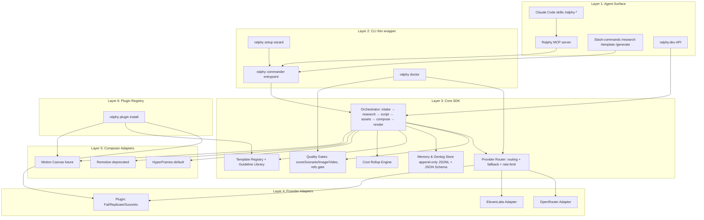

# Ralphy roast: full audit, strategic breakdown, target architecture, and roadmap

> Audit of the `alecs5am/ralphy` repository as of May 25, 2026 (v0.2.0, 282 commits, 6 stars, 1 fork, license `UNLICENSED`). The document is written for the owner, without hedges or politeness. If something is called garbage, it's garbage, and below is what to do about it.

---

## TL;DR — three things you need to hear first

- **You've got a VERY good "second layer" sitting in the repo (playbook discipline, MODELS.md as a living knowledge base, append-only genlogs, intake gates, `--dry-run`, an async jobs.sqlite queue, a production-grade install.sh) — this is rare, serious, production-grade engineering.** But the "first layer" (positioning, README, install narrative, demo, distribution, license) is at the level of a decent pet project. You're building a Boeing and selling it as a kick-scooter — hence 6 stars against MoneyPrinterTurbo's 52.5k. This is **not a product defect** — it's a defect of packaging and momentum.
- **The main competitor is NOT Higgsfield Supercomputer.** Higgsfield is playing the SaaS-agent game with its own models and influencer distribution on a $300M ARR trajectory; you can't catch it head-on. Ralphy's real competition is the OSS agent-native CLI layer (aider 45.2k, Cline 58-62k, claude-code-router 26.4k, Continue 32-33k, OpenInterpreter ~58k) and the framework level (Remotion 47.3k, HyperFrames by HeyGen, MoneyPrinterTurbo 52.5k). Higgsfield is your **"anti-pattern poster"**: they're a closed SaaS agent going for Marketing Studio + Hermes Agent + MCP; it's precisely their closedness you should push off of for positioning. An open, forkable, agent-native CLI = the only defensible niche.
- **A roadmap to 10k+ stars in 12 months exists, but it requires brutal cutting**: switch the license to Apache 2.0 today, rewrite the README on the aider/OpenInterpreter pattern (60-second MP4 + one-line install + benchmark/leaderboard), delete Remotion and `dashboard/`, ship `ralphy mcp serve` by v0.3.0, rename `package.json.name`, pull MODELS.md out as a public SEO page, launch a public "Ralphy Quality Score" leaderboard (the way aider did on SWE-Bench Lite), and close the distribution gap with a weekly Friday Ship.

---

## Key Findings

1. **Architecturally Ralphy is already ahead of its OSS competitors.** Single-key setup, the hard invariant "`ralphy` is the only entry point," a JSON-default CLI, an async job queue with topo-sort and symbolic deps, append-only genlogs with a regen→.v2 rule, refuse-not-warn quality gates, an intake playbook, MODELS.md with a per-model param matrix and a lessons section — none of ShortGPT, MoneyPrinterTurbo, or Hyperframes-without-scaffolding has this set. This is your real moat.
2. **In distribution terms, Ralphy is currently a zero.** 6 stars after 282 commits and a public landing page (ralphy.dev) is a signal that the engineering work is being done while the media work isn't being done at all. For comparison, Higgsfield ships, per their own CEO Alex Mashrabov, "*We release product updates almost every day. This rhythm keeps us learning faster than anyone else in the space, and that's unlikely to change.*" Without a comparable *cadence of public artifacts*, not CLI updates, you won't hit even 1k stars.
3. **The `UNLICENSED` license is a one-line stop flag for any corporate adoption.** It's the cheapest fix in this report and the highest-leverage. An Apache 2.0 PR is 5 minutes, +x% to star-growth speed for free.
4. **The package name `package.json.name: "ugc-cli"` + description "My Remotion video" + binary `ralphy` + npm `@alecs5am/ralphy` — fragmented identity.** A forker opens package.json and sees four different names for one and the same product. It's a small but *first* crack in trust.
5. **Remotion as "legacy" — still written into the dependencies (4.0.441), into `remotion.config.ts` at the repo root, into `"dev": "remotion studio"` in scripts.** Worse, Remotion has a commercial license: per their LICENSE.md and remotion.dev/docs/license, *"Remotion is free to use for individuals and companies up to three people"* — a Company License is required from **four employees and up**. That means legally Ralphy right now is not open-source for any forker with a team of 4+. Removing Remotion from the default is yesterday's work.
6. **HyperFrames is the right composer choice, but Ralphy is currently a thin wrapper over the `hyperframes^0.6.31` npm package.** HyperFrames is open-source from HeyGen under Apache 2.0, a direct competitor to Remotion with a better license and an AI-first DX. Their positioning: *"Remotion's bet is React components; Hyperframes' bet is HTML."* That's a plus — but if HeyGen forces its own `hyperframes` CLI tomorrow and swallows orchestration upward, you have no protection without an explicit Composer Adapter layer (see §4).
7. **MODELS.md (21.2 KB) is the best content in the repo and at the same time a hidden file.** Postmortem knowledge (kling rotation bias on 9:16, the seedance privacy filter on photoreal humans with the error `InputImageSensitiveContentDetected.PrivacyInformation`, gpt-5.4-image-2 concurrent cap of 1, elevenlabs music_v1 cap of 2, gemini IMAGE_SAFETY on body-horror) — this is a unique SEO/content moat that is currently hidden. Pulling it out as ralphy.dev/models is free evergreen content.
8. **The "casual users" segment is correctly discarded.** It's not a priority. Higgsfield Marketing Studio (paste URL → 9 UGC formats), HeyGen, Captions, Submagic, OpusClip — they'll take that audience through UX and influencer distribution. Ralphy has no chance there, and it's good that the owner already understands this.
9. **The `dashboard/` folder + the invariant "no auto-launched processes, chat is the interface" — an internal contradiction** that signals the owner hasn't decided. It needs deciding yesterday: CLI-only or CLI+UI. If CLI-only — delete the folder.
10. **The MCP server is missing.** In 2026 this is a must-have. Higgsfield rolled out `mcp.higgsfield.ai/mcp` on April 28, 2026, which exposes 30+ models (Sora 2, Veo 3.1, Kling 3.0, Seedance 2.0, Nano Banana Pro, Soul 2.0, Flux 2) as agent tools in Claude/Cursor/OpenClaw. If Ralphy is positioned as "Claude Code + Ralphy," `ralphy mcp serve` has to be in v0.3.0.

---

## Details

### 1. Subsystem-by-subsystem breakdown

| Layer | What's there | Strengths | Weaknesses / antipatterns |
|---|---|---|---|
| **CLI (`cli/index.ts`, Commander)** | Resource-based CRUD: brand/persona/ref/project/template/batch/asset/workspace/profile + generate/render/queue/daemon/doctor/setup. JSON-default, `-p` pretty. `--dry-run` on video. | The contract "JSON by default + `-p` for humans" is serious. `--dry-run` with a cost estimate. Lint suite (`lint:errors`, `lint:help-examples`, `lint:skills`, `lint:agents-md`). | `package.json.name === "ugc-cli"` while the binary is `ralphy` and npm is `@alecs5am/ralphy`. Description `"My Remotion video"` — an artifact. `license: UNLICENSED` for an OSS project — death of stars. |
| **Agent / Playbook (`AGENTS.md`, `docs/playbooks/`, `.agents/skills/`)** | Routing table user→playbook, the "read the playbook → act" discipline, dev-mode/user-mode, hard invariants (no FAL_KEY, ralphy = only entry-point, ref-required gate, quality gates refuse-not-warn). | **The strongest part of the project.** Nobody in OSS does playbook discipline at this level. The idea "AGENTS.md = a routing contract for Claude Code" is a direct plug into the Claude Code skills ecosystem and the new MCP world. | 16.6 KB of one system-prompt file — expensive in tokens on every call. It needs segmentation: a thin router (`AGENTS.md`, 2-3 KB) + lazy-loaded playbook blocks. Right now the agent eats AGENTS.md+CLAUDE.md+MODELS.md (21 KB) on every turn. |
| **Intake / Quality Gates (`docs/playbooks/intake.md`, `scoreScenario`, `scoreImage`, `scoreVideo`)** | Brand/audience/aesthetic clarification, refuse-on-double-fail logic, refs-required-gate for real entities. | Conceptually unique in OSS. The closest analog is only at Higgsfield (Approval Gates), but theirs is closed. | It's not obvious from the README that these gates exist. This is your headline feature — and you're hiding it. |
| **Research (`ralphy research`, `ralphy ref`, `.agents/skills/ralphy-researcher`)** | Deep-research, scrape-trends, blueprint, guideline library, `template suggest`. | Also unique: neither ShortGPT, MPT, nor Hyperframes does this. | The naming is smeared: `ref`, `research`, `guideline`, `template suggest`, `clone <url>`. For a new user — five commands about "find inspiration," and it's unclear when to use which. You need an umbrella: `ralphy research` with subdomains. |
| **Generation routing (OpenRouter + ElevenLabs via `cli/lib/providers/media.ts`, `llm.ts → callLLM()`)** | A clean abstraction: one entry point for media, one for LLM. A hard invariant forbids direct fetches to fal.ai/openai.com. An async-job pattern for OpenRouter video (15s × 80 = 20 min poll). Per-model whitelists. Auto-strip C2PA/EXIF on frames (fix 2026-05-19). | Production-level. MODELS.md is maintained as a living knowledge base. Recorded lessons — kling rotation bias on 9:16, the seedance privacy filter (`InputImageSensitiveContentDetected.PrivacyInformation`), gpt-5.4-image-2 concurrent cap = 1 (returns a misleading 403 "Key limit exceeded"), elevenlabs music_v1 cap = 2 (429 `concurrent_limit_exceeded`), gemini IMAGE_SAFETY on body-horror. | There's no public TS interface `Provider { capabilities, generate, estimateCost, healthCheck }`. This is the main architectural debt for future "custom connectors" — without a formal Provider interface you won't be able to accept a PR to "add Fal/Replicate/Suno." |
| **HyperFrames composer (default, `hyperframes^0.6.31`)** | HTML+GSAP+data-attrs, seek-driven render via headless Chromium, deterministic. The CLI auto-detects the engine (HTML → HyperFrames, composition-props.json → Remotion). | A strategically correct choice: HyperFrames is open-source from HeyGen under Apache 2.0, a direct competitor to Remotion with a better license and an AI-first DX. The skills `/hyperframes`, `/hyperframes-cli` are already built into Claude Code. | Ralphy is currently a thin wrapper over the npm package + a handful of skills. If HeyGen pushes its own `hyperframes` CLI upward into orchestration — you have no protection without an explicit Composer Adapter layer. |
| **Remotion (legacy, 4.0.441)** | Kept for compatibility. | — | Pure tech debt. Remotion has a commercial license — *"Remotion is free to use for individuals and companies up to three people"* (LICENSE.md, remotion.dev/docs/license). A Company License is required from 4+ employees. Legally Ralphy right now is not OSS for any forker with a team of 4+. Remove it. |
| **Genlogs / Memory (append-only `generations.jsonl`, `user-prompts.jsonl`, `user-assets.jsonl`, `postmortem/`)** | Hard invariant #14: "append-only on generations, NEVER delete." Regen → `.<slot>.v2.<ext>`. Project-scoped memory. | DVC/W&B-level architecture. A basis for reproducibility of agent sessions. | The format isn't specified publicly (no `docs/genlog-schema.md` or JSON Schema). The community can't build tooling on top of it. |
| **Templates (`templates/` repo + `workspace/templates/` user-local)** | 5 categories, 2 kinds (`vibe-reference` × 5, `vibe-style` × 38), `template suggest <utterance>` ranks, `template use` scaffolds and auto-pulls assets from `ralphy-assets`. | A two-level namespace with workspace-override — correct. | Templates are markdown + JSON, not code. The community has no SDK for writing a testable template. Compare with Remotion's TS templates or the Hyperframes skill format. |
| **Doctor (`ralphy doctor`)** | Env health (keys, deps, project link), JSON / pretty. | One of the main "wow" moments of the first 5 minutes. | Not advertised in the README's first line. Not shown exactly what doctor checks. |
| **Batch / Daemon / Queue (`workspace/.ralph/jobs.sqlite`, WAL, topo-sort, symbolic deps)** | SQLite + WAL + auto-detached daemon + ANSI dashboard via `queue watch`. Cascade-block. | Production-grade. The key advantage over MPT (there it's a script + Streamlit). | The daemon isn't advertised. The README doesn't show "here's how you queue 100 videos overnight" — and that's a buy-it-now for the content-farm segment. |
| **Install (`install.sh`, 172 lines)** | Detect OS/arch, latest-release resolve via the GitHub API, xattr-strip Gatekeeper on macOS, rc-file PATH update (zsh/bash/fish), SHA256SUMS documented. | One of the cleanest install.sh files I've seen in OSS. Better than aider's `pip install aider-install`. | The binary is a `bun build` artifact, tied to the bun runtime. The README writes "statically-linked binary," which is technically incorrect. Not critical, but communicate more honestly. |
| **Tests (`tests/unit/`, `tests/integration/`, `tests/live/`)** | Husky pre-commit, CI on push/PR, error-code catalog drift check, help-examples vs landing parity. | A level of discipline that MPT/ShortGPT don't have. | Coverage isn't published. A test/CI badge could be in the README. |
| **Docs (`docs/`, `docs-mintlify/`, ralphy.dev on Mintlify)** | Mintlify, auto-generated CLI reference from help (`docs:cli` script). | Mintlify — the right choice. Auto-gen CLI ref — excellent discipline. | The docs-mintlify folder is separate from docs — potentially two truths. ralphy.dev is split across `/showcase`, `/docs`, `/library` — the navigation is unclear to the user. |
| **`dashboard/` folder** | Legacy React/Vite, marked `_dashboard:legacy`. | — | Delete. Contradicts invariant #5. |
| **`landing/`, `BRAND_DESIGN.md` in the root** | Branding is developed. | — | `BRAND_DESIGN.md` in the root next to `MODELS.md` — noise for a contributor. |

### 2. Grab-bag of antipatterns

1. `package.json.name === "ugc-cli"` while the binary is `ralphy` and npm is `@alecs5am/ralphy`. **Replace with `ralphy` or `@ralphy/cli`.**
2. `license: UNLICENSED`. **An Apache 2.0 PR is 5 minutes, the highest ROI.**
3. Remotion in default deps + `remotion.config.ts` in the root + `"dev": "remotion studio"`. **Delete.**
4. `bun` as a hard requirement in scripts — a barrier for the Python/enterprise audience. **Ship reality (the binary), drop `bun` from user-facing docs.**
5. AGENTS.md+CLAUDE.md+MODELS.md = ~45 KB of system prompt on every turn. **Segmentation: a thin router + lazy-loaded playbooks.**
6. Daemon/queue/batch — a ninja feature in `--help`, absent from the README. **A README block "batch 100 videos overnight."**
7. The `ralphy-assets` companion repo is mentioned, but without a live primary link in the README.
8. "5 things to try first" without a gif/asciinema/expected output.
9. MODELS.md — the best content, hidden in a `.md` file. **Pull it out as ralphy.dev/models with SEO for `kling pricing`, `seedance privacy filter`, `veo 3.1 4k`.**
10. ralphy.dev/#showcase promises 11 rendered outputs — there isn't a single embedded autoplay MP4 in the hero.
11. Skills are duplicated between `.agents/skills/` and `.claude/skills/`. **One source + a scripted sync.**
12. **No MCP server.**
13. "UNLICENSED for now. Drop a note in Discussions if you want a permissive license" — nobody will write. They'll close the tab.

### 3. Competitive map (2026-05-25)

| Player | Layer | Stars | License | Custom models | Agent layer | Composer | What it takes from Ralphy |
|---|---|---|---|---|---|---|---|
| **Higgsfield Supercomputer** | Closed SaaS | n/a | Closed | Own (DoP, Soul 2.0, Steal) + 30+ orchestrated (Sora 2, Veo 3.1, Kling, Seedance, Nano Banana) | Hermes Agent + Skills Marketplace + Memory + Approval Gates + MCP | Web canvas + Cinema Studio 3.5 (1,296 virtual lenses) | Everything except openness. $300M ARR run rate in 11 months. |
| **Higgsfield Marketing Studio + Hermes Agent** (launched ~April 23, 2026) | Closed SaaS | n/a | Closed | See above | Hermes | See above | A direct competitor to your UGC pipeline. MCP since April 28, 2026. |
| **HyperFrames (HeyGen)** | OSS framework | (new) | Apache 2.0 | — | — | **This is your composer.** | If HeyGen moves upward into orchestration — it eats your top. |
| **Remotion** | Source-available framework | 47.3k | Free for 1-3 employees, Company License from 4+ | — | Prompt-to-video templates | Their layer | Competes for "video composer for developers." |
| **MoneyPrinterTurbo (harry0703)** | OSS app | 52.5k (v1.2.6, May 2026) | MIT | No | No — it's a script | MoviePy (Python) | A huge audience of brainrot faceless shorts. Doesn't overlap with you by target, but steals *attention* in the "AI short video OSS" category. |
| **ShortGPT (RayVentura)** | OSS framework | 6.6k | — | No | No | Custom EditingEngine | Stalled (v0.3.0 — Feb 10, 2025). An instructive case of "framework without an agent → plateau." |
| **aider (Paul Gauthier)** | OSS CLI (coding) | 45.2k | Apache 2.0 | model-agnostic | Pair-programming | — | The template for README discipline + a benchmark leaderboard. |
| **Cline / Roo Code / Kilo Code** | VS Code extension | 58k / 24k / 16k | Apache 2.0 | model-agnostic | Yes | — | The template for skills/playbooks UX. |
| **claude-code-router (musistudio)** | OSS proxy | 26.4k (Jan 23, 2026 snapshot) | MIT | Routes Claude Code → any model | — | — | The template for "building on a hot closed CLI." |
| **OpenInterpreter (KillianLucas)** | OSS CLI | ~58k | AGPL-3 | Any | Yes | — | The template for the launch tweet + MP4 demo. |
| **Continue.dev (Ty Dunn + Nate Sesti, YC S23)** | OSS IDE extension | 32-33k | Apache 2.0 | Any | Yes | — | $5M total seed (Heavybit-led, Y Combinator, angels including Hugging Face co-founder Julien Chaumond), announced with v1.0 on February 26, 2025. |
| **n8n (Jan Oberhauser)** | OSS workflow | 108k+ | Fair-code (Sustainable Use License) | LangChain + any API | Workflow-level | — | The template for "coin your own license category." $180M Series C on October 9, 2025 at a $2.5B valuation, led by Accel with Meritech, Redpoint, Evantic, Visionaries Club, NVentures (NVIDIA's VC arm), T.Capital, follow-on Sequoia/HV/Highland Europe/Felicis. |

### 4. Where Ralphy actually stands

**Real moat (narrow, defensible):**
- Playbook discipline + intake + quality gates + append-only genlogs + postmortem flow + research engine — nobody in OSS has this.
- MODELS.md as a living knowledge base — a free SEO/content moat.
- Single-key setup (OPENROUTER + ELEVENLABS) + transparent cost (`--dry-run`) — a philosophy plus a feature.

**Fake/weak moat:**
- HyperFrames as a "proprietary composer" — no, it's HeyGen's Apache 2.0. You're a user, not an owner.
- "Hybrid agent core" — standard. Everyone is "hybrid."
- "No GPU required" — Higgsfield doesn't need one either, neither does MPT.
- "OpenRouter only" — an operational choice, not a moat. The future moat is the custom-connector ecosystem, which Higgsfield will never build (they're a closed SaaS).

### 5. The "developer-first agent for video" thesis

It holds partially. The word "developer" in 2026 is stretched. A strong rephrasing of the thesis:

> **"*Your AI video pipeline as code — fork-able, observable, reproducible.*"**
> Subtitle: *"Claude Code + Ralphy = video as your build artifact."*

The words `as code`, `fork-able`, `observable`, `reproducible` are concrete technical properties that Higgsfield can't copy (a closed SaaS) and that Ralphy embodies (genlogs, postmortems, templates as git, MODELS.md).

### 6. OSS-growth patterns (what to copy)

| Source | Pattern | Apply to Ralphy |
|---|---|---|
| **aider (Paul Gauthier)** | Its own public benchmark/leaderboard. Per the post aider.chat/2024/05/22/swe-bench-lite.html: *"Aider scored 26.3% on the SWE Bench Lite benchmark, achieving a state-of-the-art result. The previous top leaderboard entry was 20.3% from Amazon Q Developer Agent."* The README is a wall of quotes from HN/Discord/X/GitHub. | Launch a "**Ralphy Quality Score**" — a public leaderboard of rendered videos with auto-scoring (a vision LLM on the hook frame × VO length × scene count). A submit form for the community. It's both a benchmark and witnessable distribution. |
| **Cline (Saoud Rizwan)** | Launched via X (sdrzn) on the day Claude 3.5 Sonnet released, ~10 days after the Anthropic hackathon. Original tweet: *"Excited to share Claude Dev 🤖 an autonomous software engineer right in your IDE! Made possible thanks to breakthroughs in agentic coding by Anthropic's new Claude 3.5 Sonnet."* Distributed via the VS Code Marketplace, renamed Claude Dev → Cline on October 9, 2024 with v2.0 (XML tool-calling, ~40% token reduction). | A big Ralphy 0.3.0 release on the day of the next frontier-model launch (Sora 3, Veo 4, Kling V4). Distribute via the Claude Code skills registry, HyperFrames skills, and in the first week — Show HN. |
| **OpenInterpreter (KillianLucas / @hellokillian)** | Launch tweet on September 6, 2023 with an MP4 demo: *"Today I'm launching Open Interpreter, an open-source Code Interpreter that runs locally."* Positioned as an "open-source clone of a hyped closed product" on the day the closed product is hot. | A 30-second screen recording of `ralphy new` → `template suggest` → `render` → a finished mp4. Pin a tweet on the day of the next Higgsfield announcement as "*open-source, fork-able alternative to Higgsfield Marketing Studio*." |
| **claude-code-router (musistudio)** | DeepSeek pricing arbitrage ($0.14/M tokens) + GLM/Zhipu sponsorship. The README is a config-as-pitch. 26.4k stars, 2.1k forks. | You already have single-key setup. Strengthen the narrative "*you pay OpenRouter directly, we take 0% margin*." Sponsorship from OpenRouter is realistically achievable. |
| **n8n (Jan Oberhauser)** | Coined its own license category, "fair-code." Docker one-liner. Community-first hire. $180M Series C at a $2.5B valuation (Accel + Meritech + Redpoint + Evantic + Visionaries Club + NVIDIA NVentures + T.Capital, October 9, 2025). | Decide on a license (Apache 2.0). One issue, one PR — today. |
| **Continue (Ty Dunn)** | $5M total seed (Heavybit + YC + angels) announced with v1.0 on February 26, 2025 + the Continue Hub launch. EZNewswire/BigTechnology: *"Backed by Heavybit and Y Combinator, Continue has raised a total of $5 million in seed funding"* (angels including Hugging Face co-founder Julien Chaumond). | When v1.0 lands — package it with one new artifact (Ralphy Hub / Plugin Registry) and make it an announcement day. |
| **Remotion (Jonny Burger)** | Partnership with GitHub Unwrapped (Dec 2022) + a cite from Fireship. 47.3k stars under a source-available license. | Find one big influencer channel (Fireship, Theo, Cassidy Williams). One shoutout = +3-5k stars in a week. |
| **Higgsfield (anti-pattern in tactics, template in cadence)** | 4-7 ships a week, 200+ releases in a year. Direct quote from Mashrabov (productgrowth.blog teardown): *"We release product updates almost every day. This rhythm keeps us learning faster than anyone else in the space, and that's unlikely to change."* His own admission after the suspension on February 9, 2026 (Mashrabov X post Feb 11, quoted by piunikaweb.com): *"Rapid scaling brings real challenges. We acknowledge that our internal processes and external communications haven't always kept pace with our core values, and we have made mistakes."* | Copy the cadence, reject the method (no payola influencers, no "Unlimited Kling" false claims). One public Friday Ship per week. Counter-narrative: "*we ship weekly, we ship in public, we ship under Apache 2.0.*" |

### 7. Differentiation from Higgsfield

**Higgsfield strengths and counter-moves:**

| Higgsfield | Ralphy counter-position |
|---|---|
| Custom foundation models (DoP image-to-video with camera controls, Soul 2.0 photoreal, the Steal browser extension launched July 2025) | *"We orchestrate the best models in the world via OpenRouter — Kling, Seedance, Veo, Sora 2, Nano Banana — and you swap them in a config line. No vendor lock-in."* Amplifier: once a week add an entry to `MODELS.md` via CI, show it in the Friday Ship. |
| Director presets (Cinema Studio 3.5 with 1,296 virtual lenses + Mr. Higgs co-director) | Translate their "director presets" into your three primitives: `ralphy template` (composition+storyboard+brand), `ralphy guideline` (prompt cookbook + register rules: `@guideline:photoreal-skin`, `@guideline:broadcast-realism`), HyperFrames registry-blocks. Each one — *versioned in git*, *tested by CI*, *published via PR*. |
| "Agentic Super Computer" narrative + Hermes Agent (closed SaaS) | *"Higgsfield = a closed agent that runs in their cloud. Ralphy = an open agent that runs on YOUR machine, that you can fork, audit, and ship to prod."* Technically backed by append-only genlogs + a postmortem schema = "auditable AI video" (an important frame in light of the EU AI Act). |
| Distribution via X/influencers/weekly demos. 4-7 ships/week. $300M ARR run rate (Sacra estimate, Feb 2026). $1.3B valuation after the Series A extension on January 15, 2026 (TechCrunch/PRNewswire): *"Investors in the Series A extension include Accel, AI Capital Partners (Alpha Intelligence Capital's US-based fund), Menlo Ventures, and GFT Ventures."* | Copy the cadence (Friday Ship). Reject the method. Public PR-driven examples, not paid astroturf. |

**Director presets → registry-blocks: the concrete mapping:**

```
templates/cinematic-narrative/dolly-in-golden-hour/
├── meta.yaml              # name, kind: vibe-reference, registers: [photoreal, cinematic]
├── composition.md         # 1 scene, 8s, 9:16, kling-v3.0-pro with --first-frame anchor + dolly prompt vocab
├── reference/             # 3 reference frames (with citation)
├── guideline-bind.yaml    # uses @guideline:photoreal-skin + @guideline:cinematic-camera
└── hyperframes/
    └── grade-golden-hour.html  # GSAP timeline + colour-grading CSS overlay
```

This format is *code in the repo, PR-able, testable* (lint:templates already exists). The marketing line:

> "*Higgsfield's Cinematic Studio has 50 presets. Ralphy has 50 templates. The difference: ours live in git.*"

**Anti-narrative tweets:**
- *"Higgsfield's Hermes Agent runs in their cloud, eats their credits, follows their rules. Ralphy runs in your terminal, eats your OpenRouter credits, follows your playbook. Both are agents. Only one is yours."*
- *"Your agent suspended? Your skills marketplace deplatformed? Ralphy is in your `~/.local/bin/`. Fork it, mirror it, ship it."*

---

## Target architecture

### Principles
1. One public SDK, clearly layered: `core/`, `adapters/`, `composer/`, `agent/`, `cli/`.
2. The composer is a plug-in, not hardcoded HyperFrames. HyperFrames = first-class default; a `ComposerAdapter` interface allows Remotion, Motion Canvas, Manim, custom HTML.
3. The provider is a plug-in. A `Provider` interface with `capabilities`, `generate`, `estimateCost`, `healthCheck`, `pricePerCall`.
4. Memory/Genlog — a public JSON Schema, not a private structure.
5. The agent is a separate layer that talks to the CLI over HTTP/MCP. Not glued to Claude Code (though it's the default).
6. The CLI = a thin wrapper over the Core SDK.

### Layer diagram



### Provider interface (TS spec)

```ts
// core/src/provider.ts
export interface Provider {
  id: string;                                      // e.g. "openrouter"
  capabilities: Capability[];                      // ["image","video","tts","vision","llm"]
  models: ModelDescriptor[];                       // live-fetchable
  estimateCost(req: GenRequest): Promise<CostEstimate>;
  generate(req: GenRequest, opts: GenOpts): Promise<GenResult>;
  healthCheck(): Promise<{ ok: boolean; limits?: ConcurrentLimits }>;
  preflight?(req: GenRequest): Promise<ValidationResult>;
}

export interface ModelDescriptor {
  id: string;
  capability: Capability;
  pricePerUnit: { unit: "second"|"image"|"audio_minute"|"token_1k"; usd: number };
  supportedParams: Record<string, JSONSchema>;
  knownIssues?: string[];                          // links to MODELS.md / postmortems
}
```

A custom connector — pip-style: the user publishes an npm package with a default-export `Provider`, registers it via `ralphy plugin install @org/fal-provider`, adds a key via `ralphy config set FAL_KEY=...`. The router brings it into the pool, and `ralphy generate video --provider fal --model wan-25` works.

### Composer adapter

```ts
export interface ComposerAdapter {
  id: string;
  detect(projectDir: string): Promise<boolean>;
  preview(projectDir: string, opts: PreviewOpts): Promise<URL>;
  render(projectDir: string, opts: RenderOpts): Promise<RenderResult>;
  capabilities: { registryBlocks: boolean; gsap: boolean; react: boolean; deterministic: boolean };
}
```

The HyperFrames adapter is first-class. The Remotion adapter is spun out into `@ralphy/composer-remotion`, marked "deprecated, frozen at 4.0.x."

### Plugin publishing flow

```
1. my-org/ralphy-template-cinematic-dolly/
   ├── package.json (ralphy-plugin: { type: "template" })
   ├── template.yaml
   ├── composition.html
   └── reference/
2. npm publish
3. User: ralphy plugin install @my-org/ralphy-template-cinematic-dolly
   → parses the ralphy-plugin manifest, validates via lint:templates,
     verifies SHA-256, places it in ~/.ralphy/plugins/
4. ralphy template suggest "cinematic dolly" — returns the plugin's template
```

### Genlog schema (JSON Schema v1, public)

```yaml
$schema: https://json-schema.org/draft/2020-12/schema
title: RalphyGeneration
type: object
required: [id, timestamp, kind, model, slot, project_id, status, cost_usd, request, response_ref]
properties:
  id:           { type: string, pattern: "^gen_[0-9a-z]{12}$" }
  timestamp:    { type: string, format: date-time }
  kind:         { enum: [image, video, voiceover, music, captions, llm] }
  model:        { type: string }
  slot:         { type: string, pattern: "^[a-z0-9-]+$" }
  project_id:   { type: string }
  status:       { enum: [success, failed, rejected_by_gate, cancelled] }
  cost_usd:     { type: number }
  duration_ms:  { type: integer }
  request:      { type: object }
  response_ref: { type: string }
  failure:
    type: object
    properties:
      code:    { type: string }
      message: { type: string }
      retry_count: { type: integer }
  gate_results:
    type: array
    items:
      type: object
      required: [gate, verdict]
      properties:
        gate:    { type: string }
        verdict: { enum: [pass, fail, warn] }
        score:   { type: number }
```

### Postmortem schema

```yaml
title: RalphyPostmortem
required: [project_id, created_at, what_went_wrong, root_cause, lessons]
properties:
  project_id: { type: string }
  created_at: { type: string, format: date-time }
  what_went_wrong: { type: array, items: { type: string } }
  root_cause:      { type: string }
  lessons:
    type: array
    items:
      type: object
      properties:
        scope:    { enum: [model, prompt, composition, gate, infra] }
        learning: { type: string }
        action:   { type: string }
  related_genlogs: { type: array, items: { type: string } }
```

### Doctor checks (target state)

```
ralphy doctor → JSON:
- env.bun (>= 1.x)
- env.ffmpeg (path + version >= 6.x)
- env.chromium (puppeteer cache, for HyperFrames)
- env.openrouter_key + key.balance + key.concurrent_limit_estimate
- env.elevenlabs_key + key.subscription_tier
- providers.openrouter.health
- providers.elevenlabs.health
- composer.hyperframes.installed (>= 0.7.x)
- composer.remotion.installed (deprecated warning)
- workspace.path + workspace.disk_free
- daemon.status + daemon.pid + daemon.uptime
- assets.cache_size + assets.last_sync
```

---

## Roadmap to 10k+ stars

### Phase 0 — June 2026: stop the bleeding, ship 0.3.0

**Build:**
1. Switch the license `UNLICENSED` → **Apache 2.0**. One PR, today.
2. Rename `package.json.name` to `ralphy` or `@ralphy/cli`. The description — one working sentence.
3. Remove Remotion from default deps. Move it to `@ralphy/composer-remotion` (peerDep). Delete `remotion.config.ts` from the root.
4. Delete `dashboard/` entirely.
5. Rewrite the README on the aider + OpenInterpreter pattern: MP4 hero, a 60-second pitch, a one-line install, 5 things to try first with real ASCII outputs, a testimonials wall, a link to the showcase.
6. Record a 30s hero MP4: a screencast of `ralphy new "spring espresso ad" → ralphy template suggest → ralphy render espresso-001 → played mp4`.
7. Ship `ralphy doctor` 2.0 — all checks from §Doctor.
8. Ship `ralphy mcp serve` — 5-10 key verbs (generate image/video/voiceover, render, template suggest, ref check, doctor) for Claude/Cursor/OpenClaw. **Critical for the anti-Higgsfield narrative.**

**Kill:** mentions of "Remotion (default)" in docs; the dual `.agents/skills/` vs `.claude/skills/`; `BRAND_DESIGN.md` in the root.

**Rename:** Tagline = "*Your AI video pipeline as code — fork-able, observable, reproducible.*" README hero = "*Claude Code + Ralphy. Two API keys. One CLI. A video pipeline you can ship to prod.*"

**Content:** W1 Show HN with 0.3.0. W2-4: Twitter ramp-up, 3 posts/week, at least one embedded MP4.

### Phase 1 — July–August 2026: refactor + first wows

**Build:**
1. The architectural refactor per §Target architecture: a monorepo (bun workspaces), `core/`, `adapters/`, `composer/`, `agent/`, `cli/`.
2. The `Provider` interface + `ComposerAdapter` interface published as `@ralphy/core` on npm.
3. Ship `ralphy plugin install` + the first community provider (a Fal.ai adapter or a Suno music fallback).
4. Ship genlog schema v1 + a visualizer `ralphy logs serve` (a read-only web page on localhost).
5. **A "Ralphy Quality Score" public leaderboard** on ralphy.dev with auto-scoring via a vision LLM (gemini-2.5-flash). A submit form.
6. A tutorial-content cycle: one a week on ralphy.dev/docs.

**Kill:** legacy paths/scripts (`_dashboard:legacy`), `remotion` from dependencies.

**Rename:** "Templates" → "Pipelines as templates"; "Guidelines" → "Prompt guidelines."

**Content:** Friday Ship rhythm. A `#ralphyFridayShip` hashtag. Hit r/LocalLLaMA, r/ClaudeAI, r/AIvideo. Find 1 viral creator-influencer for a tailored demo (an open bounty, not a secret payment).

### Phase 2 — September 2026 — February 2027: plugin ecosystem + demo flywheel

**Build:**
1. A plugin registry on ralphy.dev/plugins (like npm-search).
2. 3-5 community provider adapters: Fal, Replicate, Suno, Higgsfield (if they open an API), Comfy local.
3. `ralphy hub` — github-style repo discovery for templates/guidelines/blocks.
4. `@ralphy/sdk` — a programmatic API for embedded use cases.
5. Cost rollup dashboards (`ralphy cost summary --since 30d --by-project` + CSV export).
6. `ralphy postmortem auto` — auto-generation of a postmortem with a reference to the genlog after a generation failure.

**Rename:** a possible renaming before 1.0. "Ralphy" is un-rankable for SEO (Ralphy Wiggum, Ralph Lauren) and there's at least one competing `ralphy` npm package (michaelshimeles/ralphy — an autonomous bash loop in the same agent-tools niche). Alternatives: `ralpha`, `claphy` (Claude + Ralphy), or scope the npm: `@ralphy-video/cli`. **Make the decision before 1.0.**

**Content:** a monthly community show-and-tell live in Discord. Friday Ship weekly. A deep-dive blog post once a month on ralphy.dev/blog.

### Phase 3 — March–October 2027: community, content-farm vertical, paid extensions

**Build:**
1. A content-farm vertical — a preset profile for batch (100 videos/day, brand consistency, postmortem automation).
2. Optional paid extensions / Ralphy Cloud — a managed daemon + asset CDN for teams. **BUT the core is always OSS** (the Vercel vs Next.js model).
3. An education channel: a course "Build your AI video pipeline with Claude Code + Ralphy" free on ralphy.dev/learn.
4. Enterprise hardening: SSO config for providers, an audit log as a separate stream, a GDPR data-export tool for postmortems.

**Content:** Conference talks (StrangeLoop, JSConf, AIDev). A sponsorship partnership with OpenRouter. At 5k+ stars — an appearance on Fireship/Theo.

---

## Recommendations

### Top 10 "what I'd do tomorrow morning if this were my repo" (impact × effort)

| # | Action | Impact | Effort | When |
|---|---|---|---|---|
| 1 | **Change the license `UNLICENSED` → Apache 2.0** (one PR, 5 minutes) | 10 | 1 | Today |
| 2 | **Rewrite the README:** MP4 hero, a one-line install, a 5-step quickstart with real outputs, a testimonials wall (even just 3 quotes). The model — aider + OpenInterpreter. | 9 | 4 | This week |
| 3 | **Record a 30s screencast MP4** "ralphy new → render → mp4," embed in the README + the ralphy.dev hero. | 9 | 2 | This week |
| 4 | **Ship `ralphy mcp serve`** (even a minimal one, 5 verbs). The highest-leverage feature for distribution via Claude Code/Cursor/OpenClaw. | 9 | 5 | In two weeks |
| 5 | **Delete `dashboard/`, remove Remotion from the default, rename `package.json.name` to `ralphy`.** | 6 | 1 | Today |
| 6 | **Pull MODELS.md out into a public page `ralphy.dev/models`** with auto-update and SEO for `kling pricing`, `seedance privacy filter`, `veo 3.1 4k`. | 8 | 3 | This week |
| 7 | **Launch `ralphy.dev/leaderboard`** with auto-scoring (a vision LLM). The first submitted videos — your own 11 showcase clips. | 8 | 6 | This month |
| 8 | **Extract the `Provider` and `ComposerAdapter` interfaces into `@ralphy/core` npm.** Publish the first "good-first-issue": "Looking for Fal/Replicate connector contributors." | 7 | 6 | In two-three weeks |
| 9 | **Friday Ship rhythm:** one public ship on X every Friday, an embedded video. Eight Fridays in a row = 8 chances at an RT from Theo/Fireship/AIDev-tier. | 8 | 4/each | Continuous |
| 10 | **A blog post "How we tried to reproduce Higgsfield Marketing Studio in an OSS CLI"** on ralphy.dev/blog + dev.to + HN. Honest, technical, with concrete `--dry-run` cost numbers. | 7 | 3 | In two weeks |

### Concrete "delete / simplify"
- **Delete:** `dashboard/`, `_dashboard:legacy` scripts, `BRAND_DESIGN.md` in the root (move to `landing/`), `remotion.config.ts` in the root.
- **Simplify:** AGENTS.md → router-only 2-3KB + lazy-loaded `docs/playbooks/*.md`. CLAUDE.md → an empty `@`-import of AGENTS.md.
- **Consolidate:** `.agents/skills/` + `.claude/skills/` → one `skills/` + a sync script.
- **Hide as legacy:** the Remotion playbook, the `--engine remotion` flag.

### Concrete "naming / positioning fixes"
- README headline: **"*Your AI video pipeline as code.*"**
- README subheadline: **"*Claude Code + Ralphy. Two API keys. One CLI. Forkable, observable, reproducible.*"**
- Pull-quote (X bio, ralphy.dev hero): **"*OSS, agent-native CLI for AI video — built for developers who fork and ship to prod.*"**
- GitHub topics: add `agent`, `mcp`, `cli`, `developer-tools`, `openrouter`, `elevenlabs`, `hyperframes` (4 new high-traffic ones).

### Concrete "README rewrite directions"

| Repo | Stars | README hero | Yours |
|---|---|---|---|
| aider | 45.2k | Animated terminal GIF + a one-line pip install + a testimonials wall with quotes from HN/Discord/X/GitHub | Banner.png + a 4-platform install table |
| OpenInterpreter | ~58k | Embedded MP4 video + a one-line tagline + a 2-line install | Banner + bullets |
| Continue | 32-33k | Embedded GIFs of four modes (Chat/Autocomplete/Edit/Agent) | — |
| Remotion | 47.3k | Tagline + 2 showcase links (a Fireship video, GitHub Unwrapped) + capabilities bullets | — |
| MoneyPrinterTurbo | 52.5k | A demo video + bilingual + a Streamlit screenshot | — |

**Schema for the Ralphy README:**

```
[hero MP4 30s autoplay muted]

# Ralphy
Your AI video pipeline as code — fork-able, observable, reproducible.

[Tests] [Release] [npm] [Discord] [License Apache 2.0]

Claude Code + Ralphy = two API keys, one CLI, a video pipeline you can ship to prod.

## Install
brew install alecs5am/tap/ralphy
curl -fsSL ... | sh
npm install -g @ralphy/cli

## 60-second tour
1. ralphy setup     # paste OPENROUTER_API_KEY + ELEVENLABS_API_KEY
2. ralphy doctor    # check env
3. ralphy new "Spring espresso ad" --id e1
4. ralphy template suggest "talking head 30s product"
5. ralphy render e1
[expected ASCII output]

## Why Ralphy

| Other OSS | Ralphy |
|-----------|--------|
| Imperative scripts | Append-only genlogs + postmortems |
| Generic LLM call | Quality gates refuse-not-warn |
| One model | OpenRouter router across Kling/Seedance/Veo/Sora/Nano-Banana |
| `interpreter --do-everything` | Playbook discipline + intake gates |
| GUI editors | HTML composer (HyperFrames) you version in git |

## Wall of Love
[testimonials from Discord/X/HN]

## Architecture
[mermaid diagram from the target arch]

## Docs / Community
[Mintlify links + Discussions]
```

---

## Caveats

1. **The Higgsfield narrative is volatile.** Their main account @higgsfield_ai was suspended on February 9, 2026 (around 200k followers) for platform manipulation, a paid-influencer flood, and "Unlimited Kling" claims that Kling AI publicly denied. CEO Mashrabov admitted in a post on February 11, 2026 (per piunikaweb.com): *"Rapid scaling brings real challenges. We acknowledge that our internal processes and external communications haven't always kept pace with our core values, and we have made mistakes."* By May 2026 one of the two handles (@higgsfield_ai/@higgsfield) works. This gives you a strong *anti-narrative*, but it requires care — tie Ralphy not to "anti-Higgsfield" but to the universal principle "*open-source > closed SaaS for production video pipelines*."
2. **HyperFrames belongs to HeyGen.** They can change the license or stop maintenance. Mitigation: the composer-adapter layer makes you composer-agnostic, a fork on Apache 2.0 is always possible.
3. **The bun dependency cuts off the Python audience.** It's a deliberate choice, costing ~20-40% of the potential star pool. Mitigation: ship static binaries honestly, don't mention `bun` in user-facing docs.
4. **Model speed in OpenRouter grows fast.** Kling V4, Seedance 3, Sora 3 may land in 1-3 months, and the lessons learned in MODELS.md will go stale. This is a **feature, not a bug** — the log is updatable, turn it into a weekly shipping ritual.
5. **Custom connectors are a large engineering effort.** A good Provider interface is 1-2 weeks of work. The first community PR from an external dev — 2-3 months after publishing the interface. Don't push out Phase 1.
6. **The owner may burn out** on content cadence. Friday Ship + a tutorial-a-week is a serious load. Solution: either a 0.2 FTE Developer Advocate, or contributor-friendly issues + community demos count.
7. **The MCP spec is changing.** Don't make the glue code rigid — leave the option to migrate to A2A or ACP without rewriting the core.
8. **Legal risks of UGC.** Append-only genlogs + quality gates + a refs-required-gate are your brand-safety story (important after the Higgsfield racist-content controversy and in light of the EU AI Act, which will start requiring audit trails in 2026-2027). Strengthen this in `docs/legal/` and make it visible in the README.
9. **Sources used in this audit:** the `alecs5am/ralphy` repo (README, AGENTS.md, MODELS.md, CLI.md, package.json, install.sh), Higgsfield official pages (higgsfield.ai/supercomputer-intro, /marketing-studio-intro), TechCrunch + PRNewswire (Higgsfield Series A extension January 15, 2026), the productgrowth.blog Higgsfield teardown, piunikaweb.com (Mashrabov's Feb 11 statement), caimera.ai (the account-suspension case study), explainx.ai (a Hermes Agent technical deep dive), aider.chat/2024/05/22/swe-bench-lite.html, EZNewswire (the Continue v1.0/seed announcement), blog.n8n.io (the Series C announcement), bestofjs.org/projects/hyperframes (Apache 2.0 + Remotion comparison), remotion.dev/docs/license (the Company License threshold), github.com/harry0703/MoneyPrinterTurbo, github.com/RayVentura/ShortGPT, github.com/musistudio/claude-code-router, github.com/cline/cline, github.com/openinterpreter/open-interpreter, github.com/Aider-AI/aider, github.com/continuedev/continue, github.com/n8n-io/n8n, github.com/heygen-com/hyperframes.

---

> *"The best OSS dev-tool of 2026 doesn't win on foundation models. It wins on discipline, breakdown, and a Friday demo. You already have the discipline. The only thing missing is the Friday demo."*
>
> — end of the roast.
